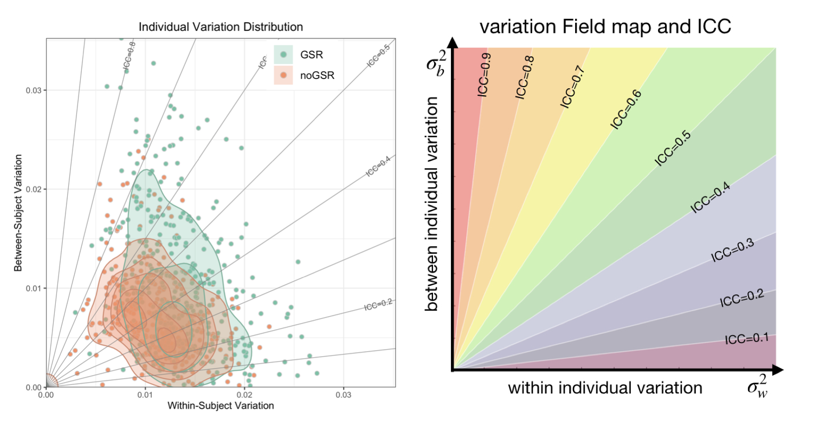
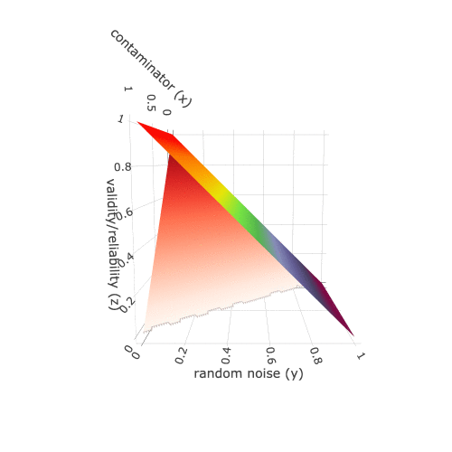
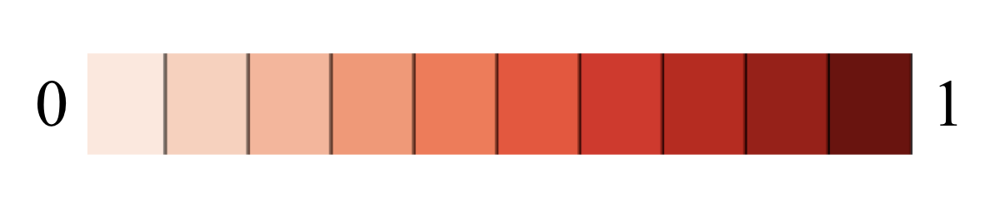

## Welcome to **Reliability Explorer (ReX)**

----

**Reliability Explorer (ReX)** is a R toolbox for calculating reliability and mapping individual variations to facilitate the assessment of reliability and reproducibility in neuroscience and psychology. This toolbox provides two modules. This toolbox provides two modules. 

1. **"Calculate Your Data"** module. This module implements parametric and nonparametric methods for univariate and multivariate reliability calculation including Intraclass correlation ([ICC](https://github.com/TingsterX/Reliability_Explorer/blob/main/tutorial_ICC_in_R.ipynb)), distance-based ICC (dbICC), Image Intraclass Correlation Coefficient (I2C2), discriminability, and identification rate (i.e. fingerprinting). The results will be presented in a two-dimensional individual variation space (see "ICC and Variation Field") to facilitate understanding of individual difference and its relation to reliability assessment. In addition, this module also provides the interactive visualization module for inspecting data and results. It will help to detect (1) which variable of interest has low reliablity, (2) which observation is a potential outliers. 

2. **"Compare Results (Individual Variation & Gradient Flow)"** module will build a pair-wise comparison of intraclass correlation and its component variations (within- and between-individual variations). The gradient flow map provides the normalized change of the ICC as compared to the most efficient direction for improving ICC, which helps to guide optimization efforts for measurement of individual differences.

**ReX** R package (https://github.com/TingsterX/ReX)

**ReX** online shiny app (https://tingsterx.shinyapps.io/ReliabilityExplorer) 


----

### Tutorials 
- Basic concept
    - [Reliability and Validity](https://github.com/TingsterX/Reliability_Explorer/blob/main/tutorial_reliability_and_validity.md)
    - [Intra-class Correlation Models](https://github.com/TingsterX/Reliability_Explorer/blob/main/tutorial_ICC_in_R.ipynb) (ICC1, ICC2, ICC3, etc.)
- ReX toolbox
    - [Calculate Reliability and Individual Variation](https://github.com/TingsterX/Reliability_Explorer/blob/main/tutorial_reliability_and_field_map.md)
    - [Compare Variation and ICC](https://github.com/TingsterX/Reliability_Explorer/blob/main/tutorial_compare_icc_and_variation.md)
    - [Run ReX in R](https://github.com/TingsterX/ReX)
    - [Run ReX from command line in docker](#run-reliability-explorer-rex-command-line-version-using-docker)
    - [Run ReX Shiny App locally in docker](#run-reliability-explorer-rex-shiny-app-locally-using-docker)
    - [Run ReX Shiny App online](https://tingsterx.shinyapps.io/ReliabilityExplorer)

----

### Quick Galace
- Reliability calculation module calculate:
    - Parametric: [Intraclas correlation](https://github.com/TingsterX/Reliability_Explorer/blob/main/tutorial_ICC_in_R.ipynb)
    - Parametric: [Distance-based IntraClass Correlation (dbICC)](https://pubmed.ncbi.nlm.nih.gov/32339252)
    - Nonparametric: [Discriminability](https://journals.plos.org/ploscompbiol/article?id=10.1371/journal.pcbi.1009279)
    - Nonparametric: [Identification rate (i.e. frinterprinting)](https://www.nature.com/articles/nn.4135)
- Reliability Comparison module:
    - [Compare individual variation using the gradient flow map](https://github.com/TingsterX/Reliability_Explorer/blob/main/tutorial_compare_icc_and_variation.md)
- Ploting module:   

    - ** Variation field map** demonstrates the individual variation and reliability

        

    - **Gradient flow** characterizes the most efficient direction for improving ICC

        

### [Applications examples](https://github.com/TingsterX/Reliability_Explorer/tree/main/application_examples)

- Application 1: Behavioral tests in Human Connectome Project 
- Application 2: Task vs survey comparison for measuring self-regulation (ref: [Enkavi et al.,
2019](https://www.pnas.org/doi/pdf/10.1073/pnas.1818430116))
- Application 3: fMRI pipelines comparision ([fMRIPrep](https://fmriprep.org/en/stable/),
[ABCD](https://www.biorxiv.org/content/10.1101/2021.07.09.451638v1),
[CCS](https://www.sciencedirect.com/science/article/abs/pii/S2095927316305394)
[C-PAC](https://fcp-indi.github.io/docs/latest/user/index))
- Application 4: fMRI pipelines with and without Global signal regression (GSR) 
- Application 5: 30min vs 10min fMRI data across pipelines
- Application 6: A single long scan vs multiple shorter scan (ref: [Cho et al., 2021](https://www.sciencedirect.com/science/article/pii/S105381192031034X))

----
### Run **Reliability Explorer (ReX) Shiny App** locally using Docker

#### Install docker

https://docs.docker.com/get-docker/

#### Pull docker image

```
docker pull tingsterx/reliability_explorer
```

#### Run docker
```
docker run --rm -p 3838:3838 tingsterx/reliability_explorer
```

#### Launch **ReX** Shiny App 

Open a web browser (e.g. Chrome), visit http://localhost:3838/rex

----

### Run **Reliability Explorer (ReX) command line version** using Docker

#### Install docker

https://docs.docker.com/get-docker/

#### Pull docker image

```
docker pull tingsterx/rex
```

#### Usage of command line in docker, run
```
docker run --rm tingsterx/rex 
```

To mount your own data folder in the docker, use [-v option](https://docs.docker.com/engine/reference/run/#volume-shared-filesystems)
```
docker run --rm \
     -v /local/path/to/your/data:/input \
     -v /local/path/to/your/output/:/output \
     tingsterx/rex 
```

#### Run R locally in docker
```
docker run -it --rm --entrypoint R \
     -v /local/path/to/your/data:/input \
     -v /local/path/to/your/output/:/output \
     tingsterx/rex
```

##### See more help messages and demo code [here](https://github.com/TingsterX/Reliability_Explorer/blob/main/rex_command_helper.md)


----

### Relationship between reliability and validity ([here](reliability_and_validity/reliability_and_validity.md))



reliability

validity


----

#### When using “Reliability Explorer (ReX)”, please cite the following manuscript:

- T Xu. J W Cho, G Kiar, E W. Bridgeford, J T. Vogelstein, M P. Milham. A Guide for Quantifying and Optimizing Measurement Reliability for the Study of Individual Differences. (doi: https://doi.org/10.1101/2022.01.27.478100)


