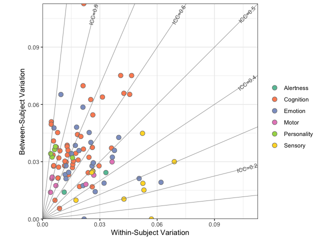

Application example 1
================
Ting Xu (github: tingsterx/reliability_explorer)
2022-07-08

### Reliability of HCP behavioral tests

This application example assess the reliability, within- and
between-individual variation across different behavioral domains using
the Human Connectome Project (HCP) data.

**Note**: The original data is not enclosed but available via the HCP
(<https://db.humanconnectome.org/>).

### load library

``` r
knitr::opts_chunk$set(warning = FALSE, message = FALSE) 
library(rstudioapi)
library(ggplot2)
library(ReX)
library(dplyr)
```

    ## 
    ## Attaching package: 'dplyr'

    ## The following objects are masked from 'package:stats':
    ## 
    ##     filter, lag

    ## The following objects are masked from 'package:base':
    ## 
    ##     intersect, setdiff, setequal, union

### Set path

``` r
setwd(dirname(getSourceEditorContext()$path))
data_dir <- file.path('Application1', 'data')
out_dir <- file.path('Application1', 'results')
dir.create(out_dir, showWarnings = FALSE)
```

### Load the data

``` r
# read in variable names
fname <- paste0(data_dir, '/behavioral_scores/variables_behavioral.csv')
df_dv <- read.csv(fname, header=TRUE)
# time 1 
fname <- paste0(data_dir, '/behavioral_scores/hcp_1200_allbehavior.csv')
df1 <- read.csv(fname, header=TRUE)
df1 <- cbind(df1[,c("Subject","Release", "Gender")],  df1[,(variable.names(df1) %in% df_dv$Task)])
# time 2
fname <- paste0(data_dir, '/behavioral_scores/hcptrt_behavioral.csv')
df2 <- read.csv(fname, header=TRUE)
df2 <- cbind(df2[,c("Subject","Release", "Gender")],  df2[,(variable.names(df2) %in% df_dv$Task)])
# read in restricted data (age)
fname <- paste0(data_dir, '/behavioral_scores/S1200_Retest_joined_behavioral.csv')
df_age <- read.csv(fname, header=TRUE)
df_age <- df_age %>% subset(select=c("Subject", "Release", "Age_in_Yrs"))
colnames(df_age) <- c("Subject", "ReleaseTRT", "Age")
# merge data (time 1 and time 2 )
df1 <- df1 %>% filter(df1$Subject %in% df2$Subject)
df2 <- df2 %>% filter(df2$Subject %in% df1$Subject)
df1$session <- 't1'
df2$session <- 't2'
df1 <- merge(df1, df_age[df_age$ReleaseTRT=="S1200", c("Subject", "Age")], by="Subject")
df2 <- merge(df2, df_age[df_age$ReleaseTRT=="Retest", c("Subject", "Age")], by="Subject")
df <- rbind(df1, df2)
```

### calculate reliability and individual variation using ReX

``` r
# scale the data
data <- as.matrix(subset(df, select=-c(Subject, Release, Age, Gender, session)))
data_scale <- data
for (i in 1:dim(data)[2]){
  data_scale[,i] <- (data[,i] - min(data[,i], na.rm = TRUE))/(max(data[,i], na.rm = TRUE) - min(data[,i], na.rm = TRUE))
}
subID <- as.matrix(df[,"Subject"])
session <- as.matrix(df[,"session"])
cov <- df[,c("Age", "Gender")]
# run the model
df_out <- data.frame(lme_ICC_2wayM(data_scale, subID, session, cov))
```

    ## [1] "Running LMM for 1.00 present ..."

``` r
for (i in 1:dim(data)[2]){
  df_out[i,'var.data'] <- var(data_scale[,i], na.rm=TRUE)
}
df_out[(rownames(df_out) %in% df_dv$Task[df_dv$Domain=="Alertness"]), 'Domain'] <- 'Alertness'
df_out[(rownames(df_out) %in% df_dv$Task[df_dv$Domain=="Cognition"]), 'Domain'] <- 'Cognition'
df_out[(rownames(df_out) %in% df_dv$Task[df_dv$Domain=="Emotion"]), 'Domain'] <- 'Emotion'
df_out[(rownames(df_out) %in% df_dv$Task[df_dv$Domain=="Motor"]), 'Domain'] <- 'Motor'
df_out[(rownames(df_out) %in% df_dv$Task[df_dv$Domain=="Personality"]), 'Domain'] <- 'Personality'
df_out[(rownames(df_out) %in% df_dv$Task[df_dv$Domain=="Sensory"]), 'Domain'] <- 'Sensory'
df_out$Task <- rownames(df_out)
fout <- file.path(out_dir, 'rex_icc.csv')
write.csv(df_out, fout)
```

### Plot all behavioral variables in one color

``` r
p <- rex_plot.var.field(df_out)
print(p)
```

<!-- -->

``` r
fname <- paste0(out_dir, '/rex_plot_var_field.pdf')
ggsave(fname, device="pdf")
```

### Summary of reliability and variation for each behavioral domain

``` r
df_out %>% group_by(Domain) %>% summarise(mean(ICC.c), sd(ICC.c), mean(sigma2_b), sd(sigma2_b), mean(sigma2_w), sd(sigma2_w))
```

    ## # A tibble: 6 × 7
    ##   Domain      `mean(ICC.c)` `sd(ICC.c)` `mean(sigma2_b)` sd(si…¹ mean(…² sd(si…³
    ##   <chr>               <dbl>       <dbl>            <dbl>   <dbl>   <dbl>   <dbl>
    ## 1 Alertness           0.488      0.0921           0.0192 0.00726 0.0222  0.0154 
    ## 2 Cognition           0.686      0.123            0.0380 0.0189  0.0175  0.0109 
    ## 3 Emotion             0.557      0.205            0.0321 0.0148  0.0245  0.0134 
    ## 4 Motor               0.638      0.177            0.0208 0.00507 0.0153  0.0132 
    ## 5 Personality         0.826      0.0874           0.0346 0.00253 0.00759 0.00462
    ## 6 Sensory             0.327      0.162            0.0203 0.0125  0.0422  0.0172 
    ## # … with abbreviated variable names ¹​`sd(sigma2_b)`, ²​`mean(sigma2_w)`,
    ## #   ³​`sd(sigma2_w)`

### Plot behavioral variables for each of six behavioral domains

``` r
p <- rex_plot.var.field.n(df_out, group.name = "Domain", size.point = 3,
                          plot.density=FALSE, show.contour = FALSE)
print(p)
```

<!-- -->

``` r
fname <- paste0(out_dir, '/rex_plot_var_field.n_BehavioralDomains.pdf')
ggsave(fname, device="pdf")
```

### Plot behavioral variables for each of three behavioral domains (with contour lines)

``` r
df_plot <- df_out[(df_out$Domain %in% c("Cognition", "Emotion", "Sensory")),]
cmap <- RColorBrewer::brewer.pal(6,"Set2")[c(2,3,6)]
p <- rex_plot.var.field.n(df_plot, group.name = "Domain", size.point = 3, color=cmap)
print(p)
```

<!-- -->

``` r
fname <- paste0(out_dir, '/rex_plot_var_field.n_CognitionEmotionSensory.pdf')
ggsave(fname, device="pdf")
```

### Plot behavioral variables for Personality

``` r
df_plot <- df_out[(df_out$Domain %in% c("Personality")),]
p <- rex_plot.var.field.n(df_plot, group.name = "Task", size.point = 4,
                          plot.density=FALSE, show.contour = FALSE,
                          axis.min = 0, axis.max = 0.05)
print(p)
```

<!-- -->

``` r
fname <- paste0(out_dir, '/rex_plot_var_field.n_Personality.pdf')
ggsave(fname, device="pdf")
```
