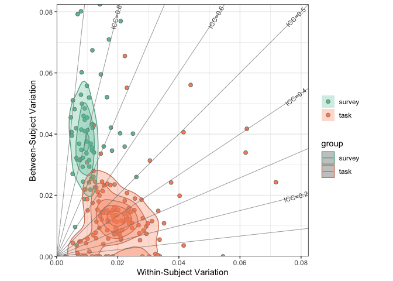

Application example 2
================
Ting Xu (github: tingsterx/reliability_explorer)
2022-07-08

### Reliability of Self-regulation test

This application example re-analyzed the self-regulation test-retest
data from the previously published study [Enkavi et al.,
2019](https://www.pnas.org/doi/pdf/10.1073/pnas.1818430116)

### load library

``` r
knitr::opts_chunk$set(warning = FALSE, message = FALSE) 
library(rstudioapi)
library(ggplot2)
library(ReX)
library(dplyr)
```

    ## 
    ## Attaching package: 'dplyr'

    ## The following objects are masked from 'package:stats':
    ## 
    ##     filter, lag

    ## The following objects are masked from 'package:base':
    ## 
    ##     intersect, setdiff, setequal, union

### Set path

### Load the data

Raw data: <https://github.com/IanEisenberg/Self_Regulation_Ontology>

``` r
t1_dir <- paste0(data_dir, '/Data/Complete_02-16-2019')
t2_dir <- paste0(data_dir, '/Data/Retest_02-16-2019')

# time point 1
fname <- paste0(t1_dir, '/meaningful_variables_clean.csv')
df1 <- read.csv(fname, header=TRUE)
df1 <- rename(df1, "subID"="X")
# time point 2
fname <- paste0(t2_dir, '/meaningful_variables_clean.csv')
df2 <- read.csv(fname, header=TRUE)
df2 <- rename(df2, "subID"="X")
# select subjects complete both t1 and t2
df1 <- df1 %>% filter(df1$subID %in% df2$subID)
df2 <- df2 %>% filter(df2$subID %in% df1$subID)
df1_dv <- variable.names(df1[,2:dim(df1)[2]])
df2_dv <- variable.names(df2[,2:dim(df2)[2]])
write.csv(df1_dv, paste0(out_dir, '/orig_variable_names_test.csv'))
write.csv(df2_dv, paste0(out_dir, '/orig_variable_names_retest.csv'))
```

#### reorganize the variales

-   delete the non-overlapped variables
-   rename the variables that are not consistent in t1 and t2

#### find the task and survery variables

``` r
fname <- paste0(t1_dir, '/taskdata_clean.csv')
df1_task <- read.csv(fname, header = TRUE)
df1_task <- rename(df1_task, "subID"="X")
df1_task <- rename(df1_task, 'attention_network_task.conflict_hddm_drift'='attention_network_task.conflict_hddm_drift.ReflogTr',
'attention_network_task.hddm_non_decision'='attention_network_task.hddm_non_decision.ReflogTr',
'columbia_card_task_cold.gain_sensitivity'='columbia_card_task_cold.gain_sensitivity.logTr',
'columbia_card_task_hot.loss_sensitivity'='columbia_card_task_hot.loss_sensitivity.ReflogTr',
'directed_forgetting.proactive_interference_hddm_drift'='directed_forgetting.proactive_interference_hddm_drift.logTr',
'local_global_letter.hddm_non_decision.ReflogTr'='local_global_letter.hddm_non_decision',
'motor_selective_stop_signal.hddm_thresh'='motor_selective_stop_signal.hddm_thresh.logTr')

# get the dependent variable labels
dv_task <- variable.names(df1_task[,2:dim(df1_task)[2]])
dv_surv <- subset(variable.names(df1), !(variable.names(df1) %in% variable.names(df1_task)))
```

#### merge t1 and t2 dataframe

``` r
df1$session = "t1"
df2$session = "t2"
df <- rbind(df1, df2)
```

### Calculate the ICC using ReX

``` r
data <- as.matrix(subset(df, select=-c(subID, session)))
data_scale <- data
for (i in 1:dim(data)[2]){
  data_scale[,i] <- (data[,i] - min(data[,i], na.rm = TRUE))/(max(data[,i], na.rm = TRUE) - min(data[,i], na.rm = TRUE))
}
subID <- as.matrix(df[,"subID"])
session <- as.matrix(df[,"session"])
df_icc <- data.frame(lme_ICC_2wayM(data_scale, subID, session))
```

    ## [1] "Running LMM for 0.52 present ..."

``` r
for (i in 1:dim(data)[2]){
  df_icc[i,'var.data'] <- var(data_scale[,i], na.rm=TRUE)
}
df_icc[(rownames(df_icc) %in% dv_task), 'measure'] <- 'task'
df_icc[(rownames(df_icc) %in% dv_surv), 'measure'] <- 'survey'

write.csv(df_icc, paste0(out_dir, '/icc_2wayM.csv'))
```

### Plot: survey vs. task in measuring the self-regulation

``` r
p <- rex_plot.var.field.n(df_icc, group.name = 'measure')
p
```

<!-- -->

``` r
fname <- paste0(out_dir, '/rex_plot_var_field.pdf')
ggsave(fname, device="pdf")
```
