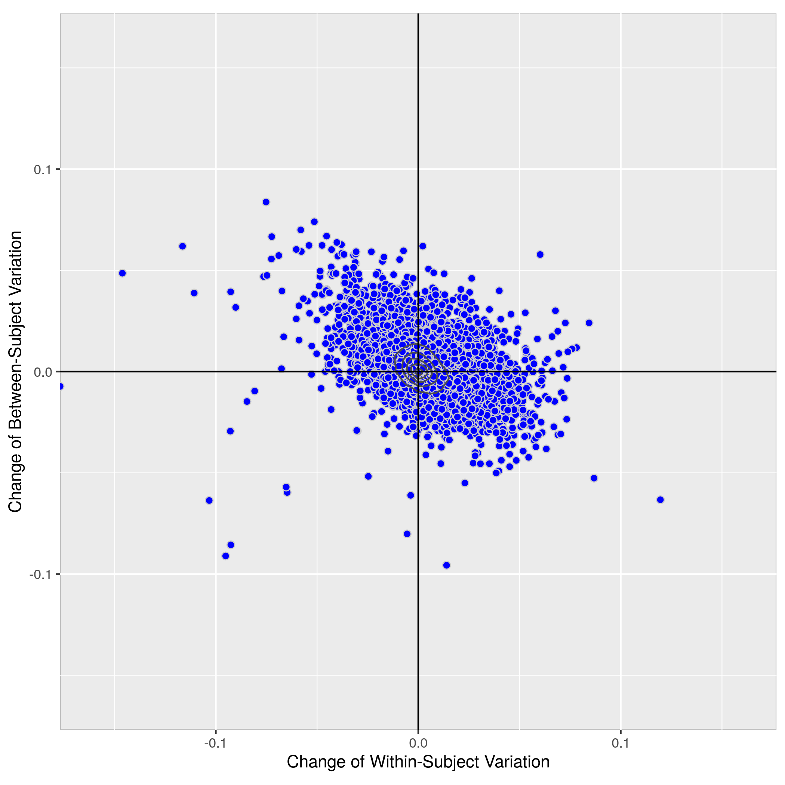

## Application 3 - Pipeline Comparison

ReX code: Application3-5/icc_HNU_*.R

ReX output: Application3-5/results_cpac_HNU/ROI_Schaefer200/rex_icc_comp

    GSR(10min): cpac_default_all_gsr vs cpac_fmriprep_all_gsr

    GSR(10min): cpac_default_all_gsr vs cpac_ccs_all_gsr

    GSR(10min): cpac_default_all_gsr vs cpac_abcd_all_gsr

    GSR(10min): cpac_fmriprep_all_gsr vs cpac_default_all_gsr

    GSR(10min): cpac_fmriprep_all_gsr vs cpac_ccs_all_gsr

    GSR(10min): cpac_fmriprep_all_gsr vs cpac_abcd_all_gsr

    GSR(10min): cpac_ccs_all_gsr vs cpac_default_all_gsr

    GSR(10min): cpac_ccs_all_gsr vs cpac_fmriprep_all_gsr

    GSR(10min): cpac_ccs_all_gsr vs cpac_abcd_all_gsr

    GSR(10min): cpac_abcd_all_gsr vs cpac_default_all_gsr

    GSR(10min): cpac_abcd_all_gsr vs cpac_fmriprep_all_gsr

    GSR(10min): cpac_abcd_all_gsr vs cpac_ccs_all_gsr

    GSR(10min): cpac_default_all vs cpac_fmriprep_all

    GSR(10min): cpac_default_all vs cpac_ccs_all

    GSR(10min): cpac_default_all vs cpac_abcd_all

    GSR(10min): cpac_fmriprep_all vs cpac_default_all

    GSR(10min): cpac_fmriprep_all vs cpac_ccs_all

    GSR(10min): cpac_fmriprep_all vs cpac_abcd_all

    GSR(10min): cpac_ccs_all vs cpac_default_all

    GSR(10min): cpac_ccs_all vs cpac_fmriprep_all

    GSR(10min): cpac_ccs_all vs cpac_abcd_all

    GSR(10min): cpac_abcd_all vs cpac_default_all

    GSR(10min): cpac_abcd_all vs cpac_fmriprep_all

    GSR(10min): cpac_abcd_all vs cpac_ccs_all

    GSR(30min): cpac_default_all_gsr vs cpac_fmriprep_all_gsr

    GSR(30min): cpac_default_all_gsr vs cpac_ccs_all_gsr

    GSR(30min): cpac_default_all_gsr vs cpac_abcd_all_gsr

    GSR(30min): cpac_fmriprep_all_gsr vs cpac_default_all_gsr

    GSR(30min): cpac_fmriprep_all_gsr vs cpac_ccs_all_gsr

    GSR(30min): cpac_fmriprep_all_gsr vs cpac_abcd_all_gsr

    GSR(30min): cpac_ccs_all_gsr vs cpac_default_all_gsr

    GSR(30min): cpac_ccs_all_gsr vs cpac_fmriprep_all_gsr

    GSR(30min): cpac_ccs_all_gsr vs cpac_abcd_all_gsr

    GSR(30min): cpac_abcd_all_gsr vs cpac_default_all_gsr

    GSR(30min): cpac_abcd_all_gsr vs cpac_fmriprep_all_gsr

    GSR(30min): cpac_abcd_all_gsr vs cpac_ccs_all_gsr

    GSR(30min): cpac_default_all vs cpac_fmriprep_all

    GSR(30min): cpac_default_all vs cpac_ccs_all

    GSR(30min): cpac_default_all vs cpac_abcd_all

    GSR(30min): cpac_fmriprep_all vs cpac_default_all

    GSR(30min): cpac_fmriprep_all vs cpac_ccs_all

    GSR(30min): cpac_fmriprep_all vs cpac_abcd_all

    GSR(30min): cpac_ccs_all vs cpac_default_all

    GSR(30min): cpac_ccs_all vs cpac_fmriprep_all

    GSR(30min): cpac_ccs_all vs cpac_abcd_all

    GSR(30min): cpac_abcd_all vs cpac_default_all

    GSR(30min): cpac_abcd_all vs cpac_fmriprep_all

    GSR(30min): cpac_abcd_all vs cpac_ccs_all

