Application example 3
================
Ting Xu (github: tingsterx/reliability_explorer)
2022-07-08

### Examine the reliability and individual varition across fMRI pipelines

This application example compares the reliability and individual
varition across four conventional fMRI pipelines including
[fMRIPrep](https://fmriprep.org/en/stable/),
[ABCD](https://www.biorxiv.org/content/10.1101/2021.07.09.451638v1),
[CCS](https://www.sciencedirect.com/science/article/abs/pii/S2095927316305394)
and [C-PAC](https://fcp-indi.github.io/docs/latest/user/index) default.
The details are described in [Li et al.,
2019](https://www.biorxiv.org/content/10.1101/2021.12.01.470790v1)

Raw data: Consortium for Reliability and Reproducibility (CoRR) - [HNU
dataset](http://fcon_1000.projects.nitrc.org/indi/CoRR/html/hnu_1.html)

**Calculation using ReX**: The individual variation, ICC for each edge
(i.e. connectivity), and dbICC at the parcel and whole connectivity
level are calcualted using the code: icc_HNU_edgewise_ICC\_*.R,
icc_HNU_parcelwise_dbICC\_*.R, icc_HNU_AllConn_dbICC\_\*.R

``` r
knitr::opts_chunk$set(warning = FALSE, message = FALSE) 
library(rstudioapi)
library(ReX)
library(ggplot2)
library(data.table)
library(dplyr)
```

    ## 
    ## Attaching package: 'dplyr'

    ## The following objects are masked from 'package:data.table':
    ## 
    ##     between, first, last

    ## The following objects are masked from 'package:stats':
    ## 
    ##     filter, lag

    ## The following objects are masked from 'package:base':
    ## 
    ##     intersect, setdiff, setequal, union

``` r
library(ggseg)
library(ggsegSchaefer)
```

### Set path

``` r
setwd(dirname(getSourceEditorContext()$path))
source('func_plot_brain_matrix.R')
```

### Comparing fMRI pipelines among fMRIprep, CCS, ABCD, CPAC

``` r
data_dir <- file.path('Application3-5', 'results_cpac_HNU', 'ROI_Schaefer200')
out_dir <- file.path('Application3-5', 'results_cpac_HNU', 'ROI_Schaefer200', 'rex_icc_comp_matrix')

# Schaefer200 label2Yeo7Network
labels2Yeo <- read.table(file.path('Application3-5', 'atlas', 'Schaefer2018_200Parcels_7Networks_labels_MatchedTo_ggseg.txt'), header=TRUE)$Yeo
Nparcel <- 200

cmap <- ReX::rgb2hex(ReX::colormap.gradient.flow())

for (amount in c("10min", "30min")){
  
  # GSR
  pipeline_list <- c("cpac_default_all_gsr", "cpac_fmriprep_all_gsr", "cpac_ccs_all_gsr", "cpac_abcd_all_gsr")
  for (pipeline1 in pipeline_list){
    for (pipeline2 in pipeline_list){
      if (pipeline1!=pipeline2){
        prefix <- sprintf('PipelineComp%s_%s-%s', amount, pipeline1, pipeline2)
        fname <- sprintf('%s/rex_icc_comp/%s_ReX_CompareICC_Results.csv', data_dir, prefix)
        df <- fread(fname)
        
        M <- matrix(0, Nparcel, Nparcel)
        M[upper.tri(M)] <- df$delta.theta_norm
        M <- M + t(M) + diag(1, Nparcel)
        M <- M[order(labels2Yeo), order(labels2Yeo)]
        
        print(sprintf('GSR(%s): %s', amount, prefix))
        p <- plot_matrix_Schaefer7_200(M, cmap)
        print(p)
        fname <- sprintf('%s/%s_ReX_CompareICC_ChangeOfVariation_Normalized_GradientFlow.png', out_dir, prefix)
        ggsave(fname, device="png")
      }
    }
  }
  
  cat('-------------------------------------------------------\n')
  # NoGSR
  pipeline_list <- c("cpac_default_all",  "cpac_fmriprep_all",  "cpac_ccs_all", "cpac_abcd_all")
  for (pipeline1 in pipeline_list){
    for (pipeline2 in pipeline_list){
      if (pipeline1!=pipeline2){
        prefix <- sprintf('PipelineComp%s_%s-%s', amount, pipeline1, pipeline2)
        fname <- sprintf('%s/rex_icc_comp/%s_ReX_CompareICC_Results.csv', data_dir, prefix)
        df <- fread(fname)
        
        M <- matrix(0, Nparcel, Nparcel)
        M[upper.tri(M)] <- df$delta.theta_norm
        M <- M + t(M) + diag(1, Nparcel)
        M <- M[order(labels2Yeo), order(labels2Yeo)]
        
        print(sprintf('No-GSR(%s): %s', amount, prefix))
        p <- plot_matrix_Schaefer7_200(M, cmap)
        print(p)
        fname <- sprintf('%s/%s_ReX_CompareICC_ChangeOfVariation_Normalized_GradientFlow.png', out_dir, prefix)
        ggsave(fname, device="png")
      }
    }
  }
  
}
```

    ## [1] "GSR(10min): PipelineComp10min_cpac_default_all_gsr-cpac_fmriprep_all_gsr"

<!-- -->

    ## [1] "GSR(10min): PipelineComp10min_cpac_default_all_gsr-cpac_ccs_all_gsr"

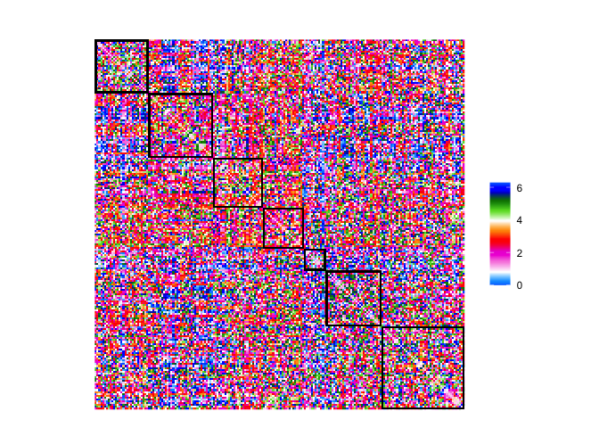<!-- -->

    ## [1] "GSR(10min): PipelineComp10min_cpac_default_all_gsr-cpac_abcd_all_gsr"

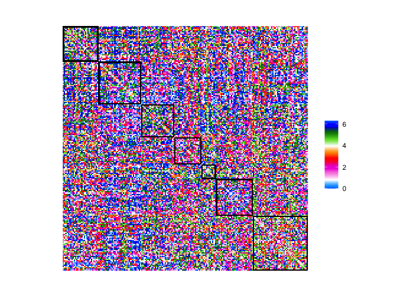<!-- -->

    ## [1] "GSR(10min): PipelineComp10min_cpac_fmriprep_all_gsr-cpac_default_all_gsr"

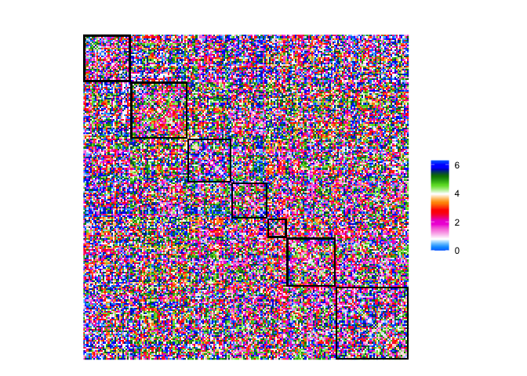<!-- -->

    ## [1] "GSR(10min): PipelineComp10min_cpac_fmriprep_all_gsr-cpac_ccs_all_gsr"

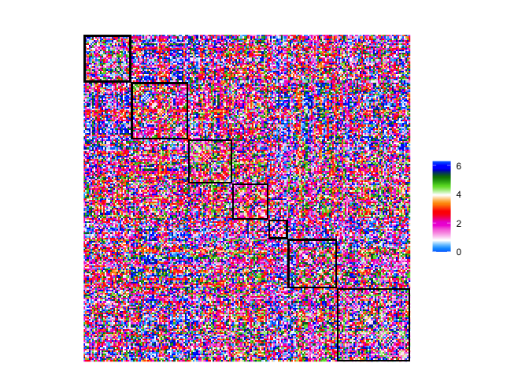<!-- -->

    ## [1] "GSR(10min): PipelineComp10min_cpac_fmriprep_all_gsr-cpac_abcd_all_gsr"

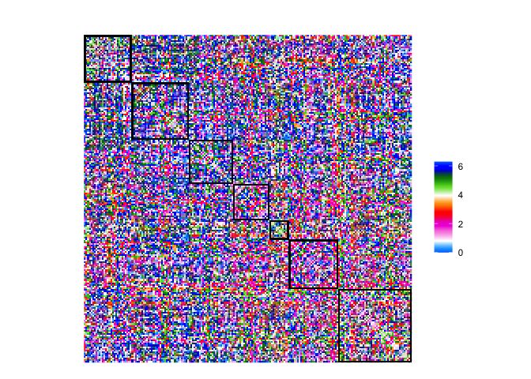<!-- -->

    ## [1] "GSR(10min): PipelineComp10min_cpac_ccs_all_gsr-cpac_default_all_gsr"

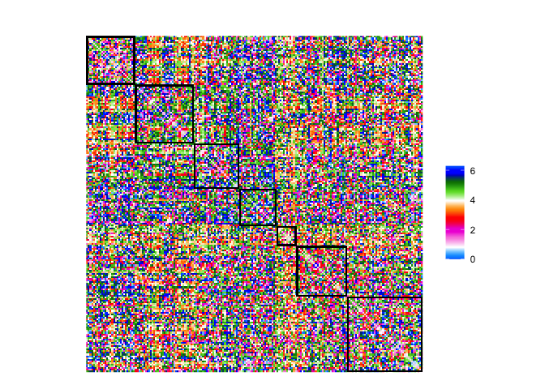<!-- -->

    ## [1] "GSR(10min): PipelineComp10min_cpac_ccs_all_gsr-cpac_fmriprep_all_gsr"

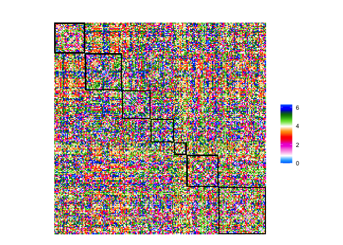<!-- -->

    ## [1] "GSR(10min): PipelineComp10min_cpac_ccs_all_gsr-cpac_abcd_all_gsr"

<!-- -->

    ## [1] "GSR(10min): PipelineComp10min_cpac_abcd_all_gsr-cpac_default_all_gsr"

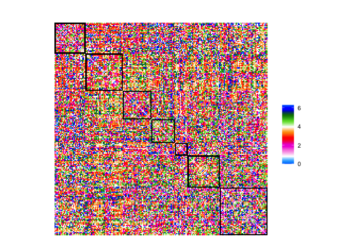<!-- -->

    ## [1] "GSR(10min): PipelineComp10min_cpac_abcd_all_gsr-cpac_fmriprep_all_gsr"

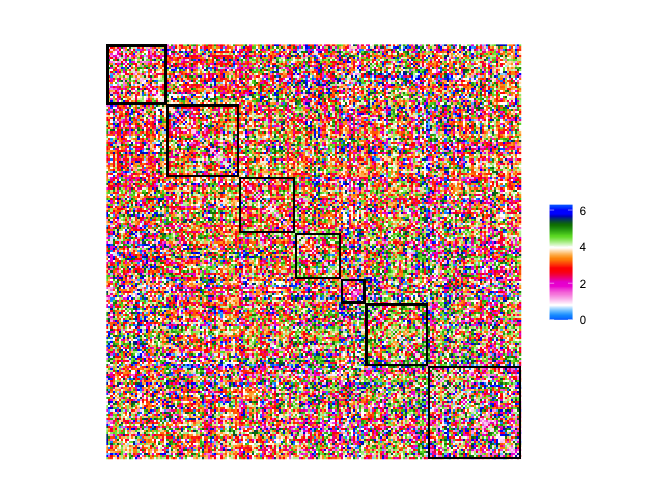<!-- -->

    ## [1] "GSR(10min): PipelineComp10min_cpac_abcd_all_gsr-cpac_ccs_all_gsr"

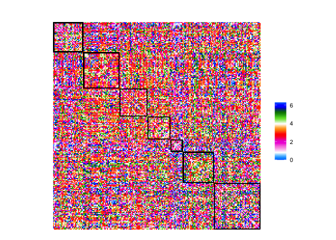<!-- -->

    ## -------------------------------------------------------
    ## [1] "No-GSR(10min): PipelineComp10min_cpac_default_all-cpac_fmriprep_all"

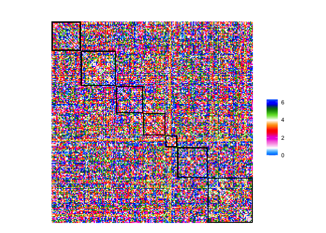<!-- -->

    ## [1] "No-GSR(10min): PipelineComp10min_cpac_default_all-cpac_ccs_all"

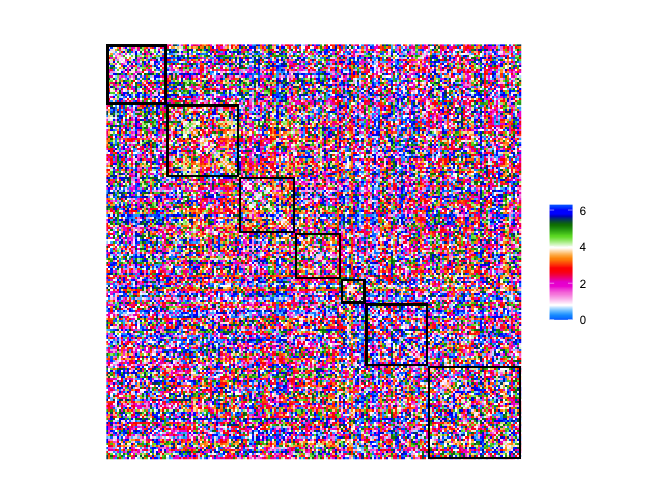<!-- -->

    ## [1] "No-GSR(10min): PipelineComp10min_cpac_default_all-cpac_abcd_all"

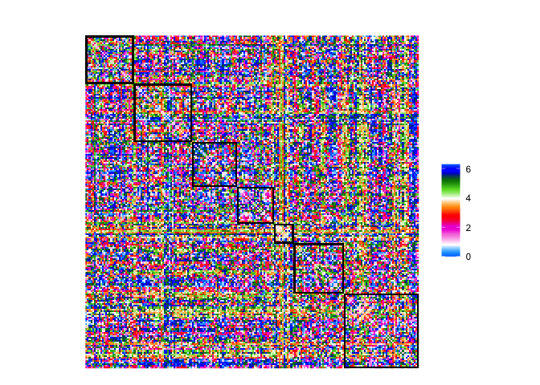<!-- -->

    ## [1] "No-GSR(10min): PipelineComp10min_cpac_fmriprep_all-cpac_default_all"

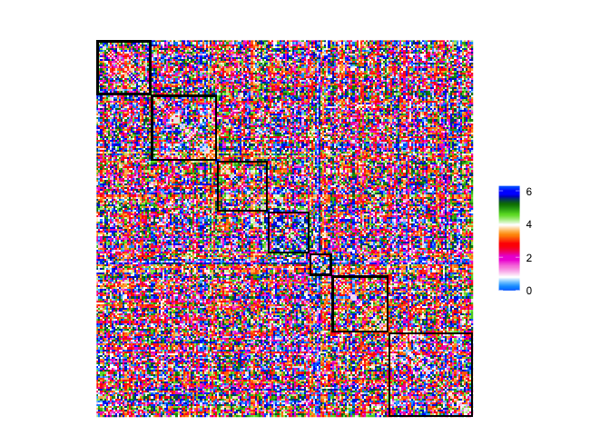<!-- -->

    ## [1] "No-GSR(10min): PipelineComp10min_cpac_fmriprep_all-cpac_ccs_all"

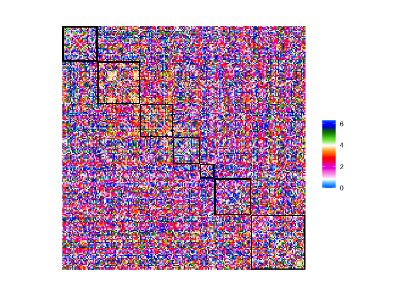<!-- -->

    ## [1] "No-GSR(10min): PipelineComp10min_cpac_fmriprep_all-cpac_abcd_all"

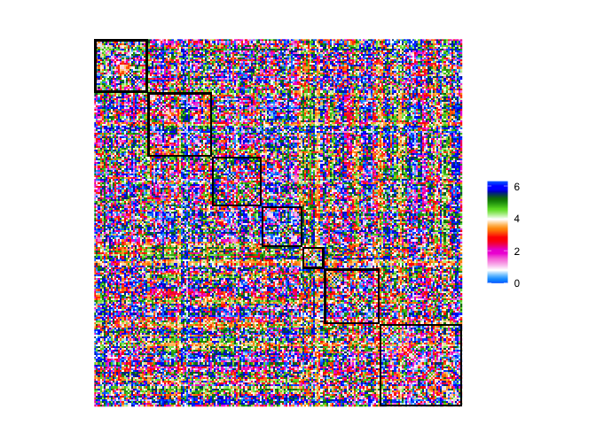<!-- -->

    ## [1] "No-GSR(10min): PipelineComp10min_cpac_ccs_all-cpac_default_all"

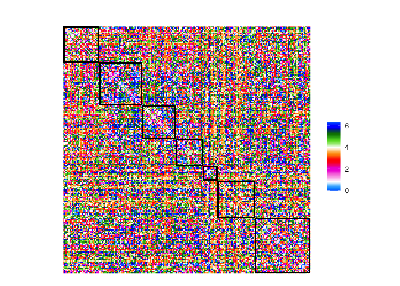<!-- -->

    ## [1] "No-GSR(10min): PipelineComp10min_cpac_ccs_all-cpac_fmriprep_all"

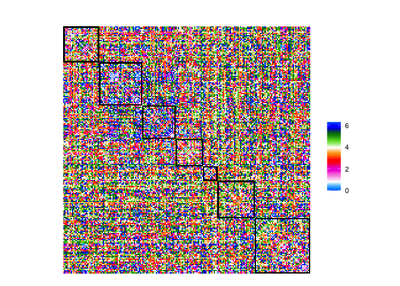<!-- -->

    ## [1] "No-GSR(10min): PipelineComp10min_cpac_ccs_all-cpac_abcd_all"

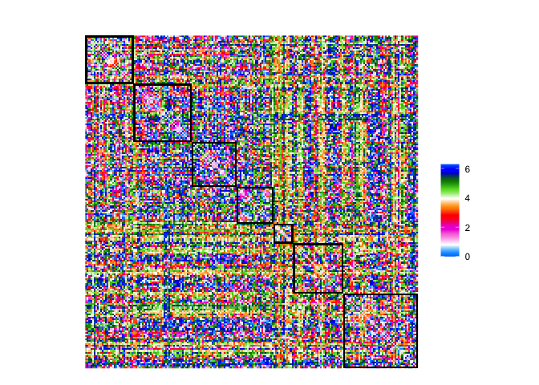<!-- -->

    ## [1] "No-GSR(10min): PipelineComp10min_cpac_abcd_all-cpac_default_all"

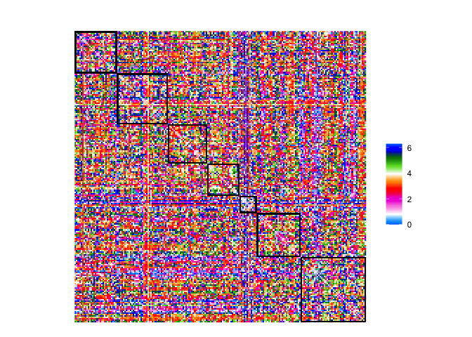<!-- -->

    ## [1] "No-GSR(10min): PipelineComp10min_cpac_abcd_all-cpac_fmriprep_all"

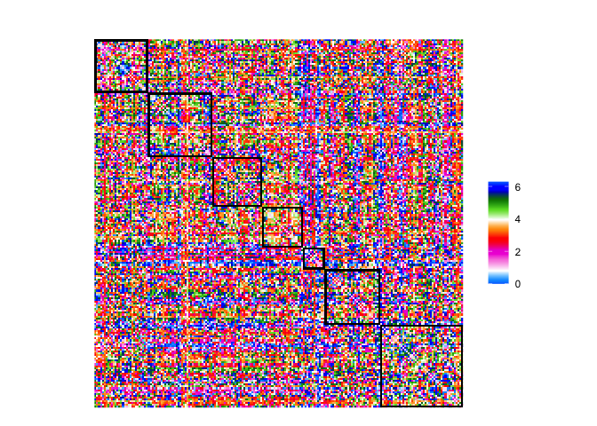<!-- -->

    ## [1] "No-GSR(10min): PipelineComp10min_cpac_abcd_all-cpac_ccs_all"

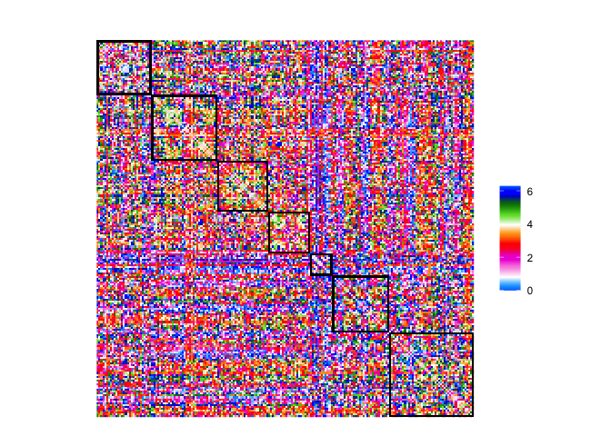<!-- -->

    ## [1] "GSR(30min): PipelineComp30min_cpac_default_all_gsr-cpac_fmriprep_all_gsr"

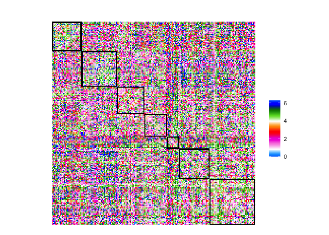<!-- -->

    ## [1] "GSR(30min): PipelineComp30min_cpac_default_all_gsr-cpac_ccs_all_gsr"

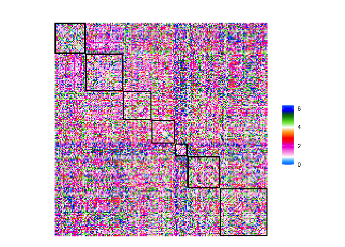<!-- -->

    ## [1] "GSR(30min): PipelineComp30min_cpac_default_all_gsr-cpac_abcd_all_gsr"

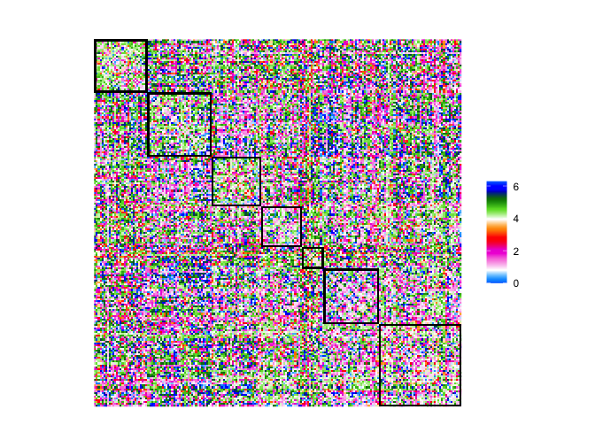<!-- -->

    ## [1] "GSR(30min): PipelineComp30min_cpac_fmriprep_all_gsr-cpac_default_all_gsr"

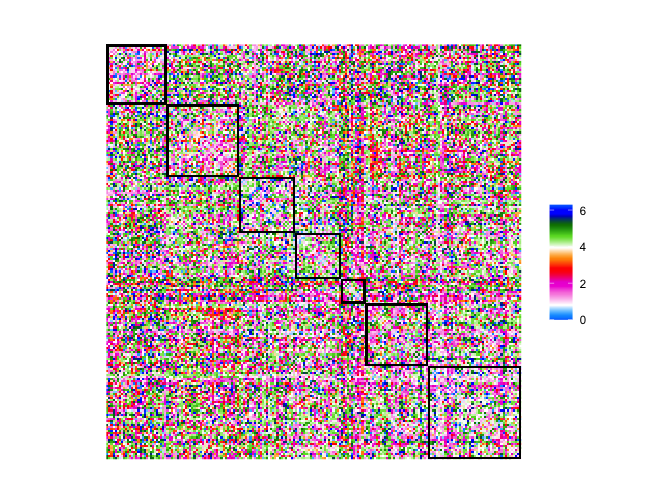<!-- -->

    ## [1] "GSR(30min): PipelineComp30min_cpac_fmriprep_all_gsr-cpac_ccs_all_gsr"

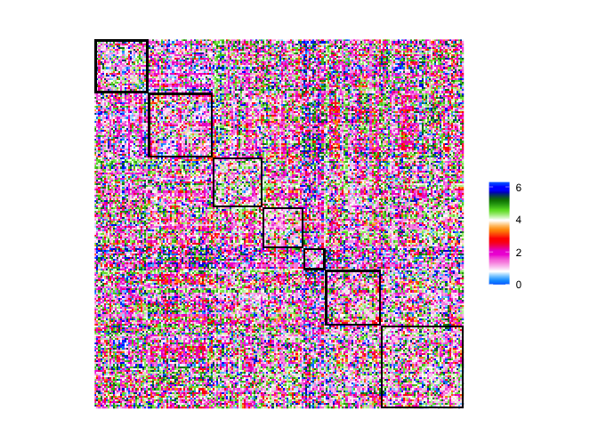<!-- -->

    ## [1] "GSR(30min): PipelineComp30min_cpac_fmriprep_all_gsr-cpac_abcd_all_gsr"

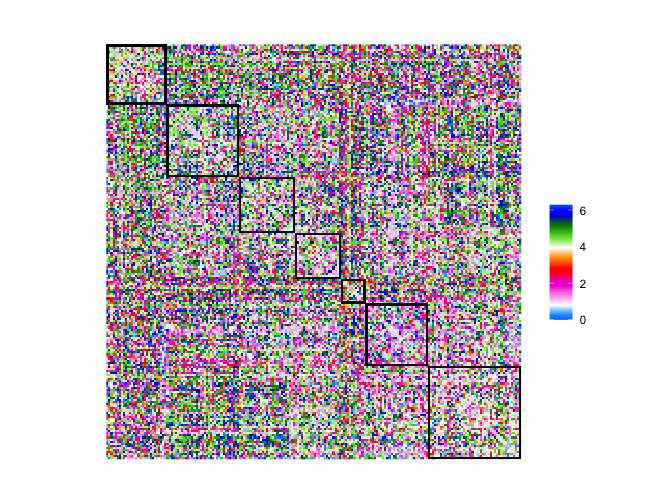<!-- -->

    ## [1] "GSR(30min): PipelineComp30min_cpac_ccs_all_gsr-cpac_default_all_gsr"

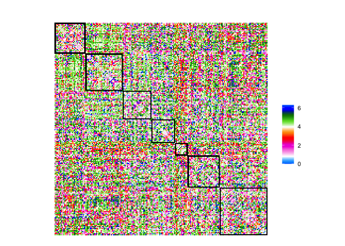<!-- -->

    ## [1] "GSR(30min): PipelineComp30min_cpac_ccs_all_gsr-cpac_fmriprep_all_gsr"

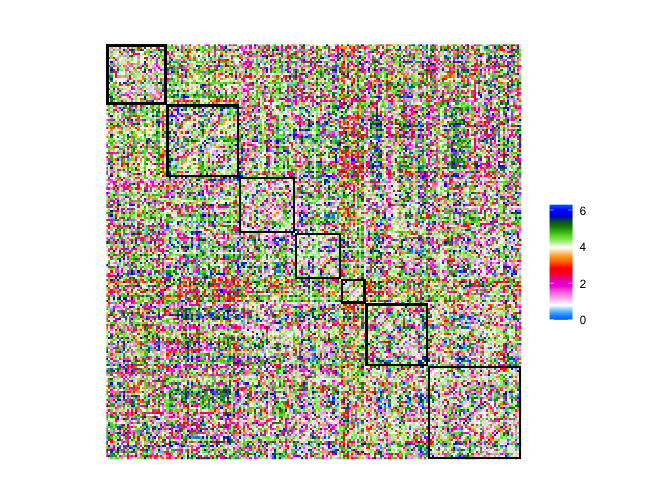<!-- -->

    ## [1] "GSR(30min): PipelineComp30min_cpac_ccs_all_gsr-cpac_abcd_all_gsr"

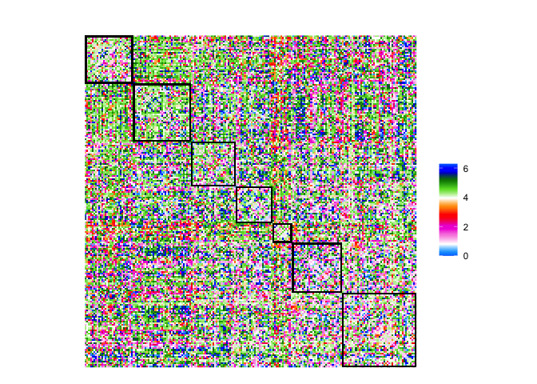<!-- -->

    ## [1] "GSR(30min): PipelineComp30min_cpac_abcd_all_gsr-cpac_default_all_gsr"

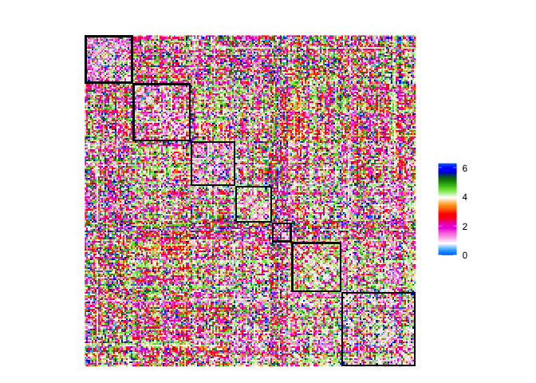<!-- -->

    ## [1] "GSR(30min): PipelineComp30min_cpac_abcd_all_gsr-cpac_fmriprep_all_gsr"

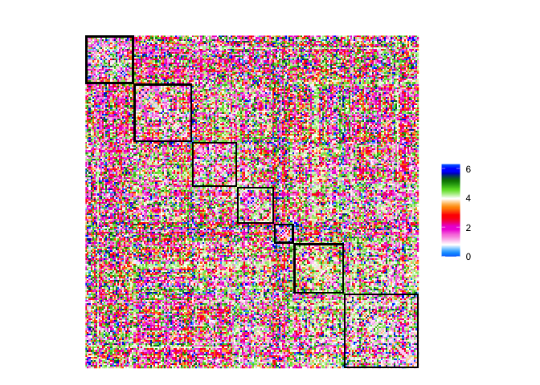<!-- -->

    ## [1] "GSR(30min): PipelineComp30min_cpac_abcd_all_gsr-cpac_ccs_all_gsr"

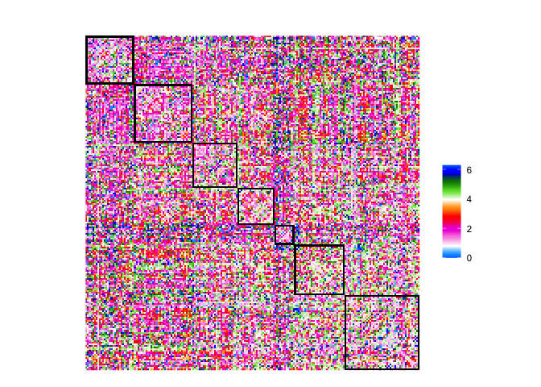<!-- -->

    ## -------------------------------------------------------
    ## [1] "No-GSR(30min): PipelineComp30min_cpac_default_all-cpac_fmriprep_all"

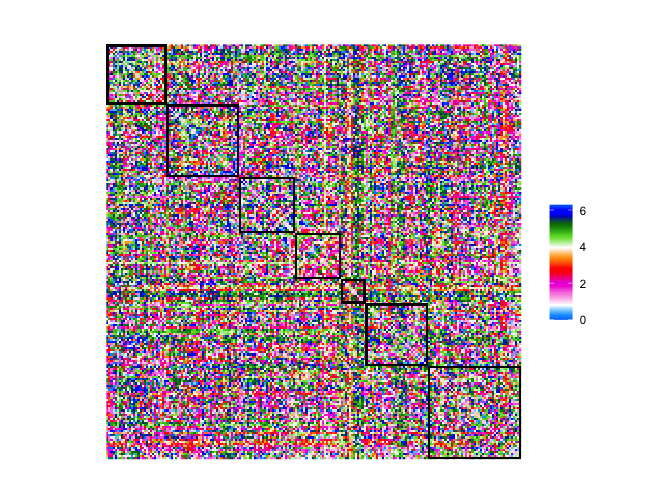<!-- -->

    ## [1] "No-GSR(30min): PipelineComp30min_cpac_default_all-cpac_ccs_all"

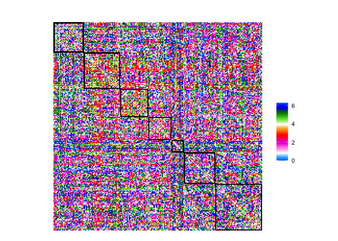<!-- -->

    ## [1] "No-GSR(30min): PipelineComp30min_cpac_default_all-cpac_abcd_all"

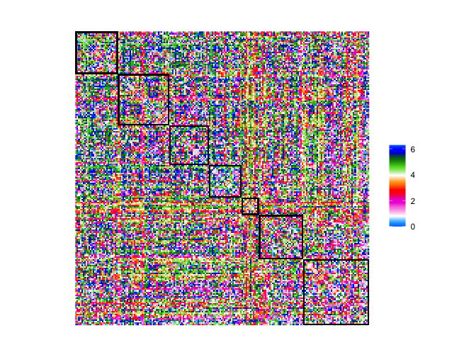<!-- -->

    ## [1] "No-GSR(30min): PipelineComp30min_cpac_fmriprep_all-cpac_default_all"

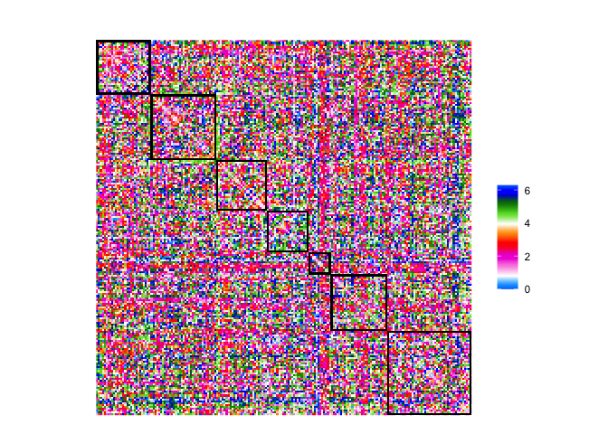<!-- -->

    ## [1] "No-GSR(30min): PipelineComp30min_cpac_fmriprep_all-cpac_ccs_all"

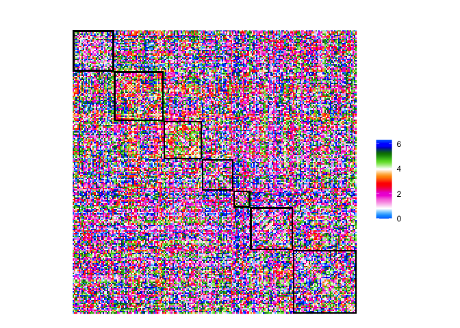<!-- -->

    ## [1] "No-GSR(30min): PipelineComp30min_cpac_fmriprep_all-cpac_abcd_all"

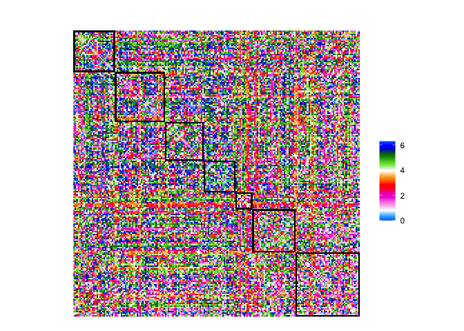<!-- -->

    ## [1] "No-GSR(30min): PipelineComp30min_cpac_ccs_all-cpac_default_all"

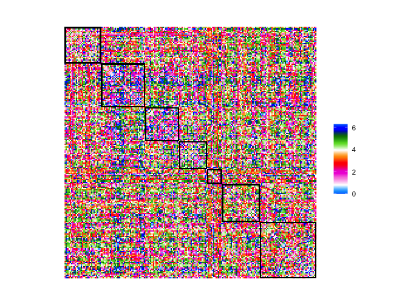<!-- -->

    ## [1] "No-GSR(30min): PipelineComp30min_cpac_ccs_all-cpac_fmriprep_all"

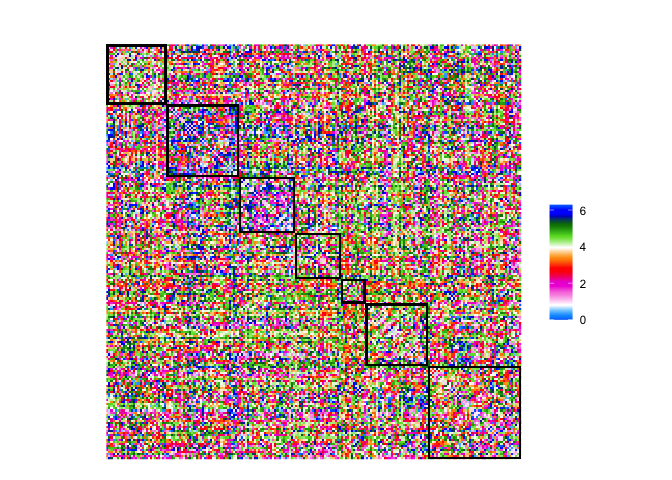<!-- -->

    ## [1] "No-GSR(30min): PipelineComp30min_cpac_ccs_all-cpac_abcd_all"

<!-- -->

    ## [1] "No-GSR(30min): PipelineComp30min_cpac_abcd_all-cpac_default_all"

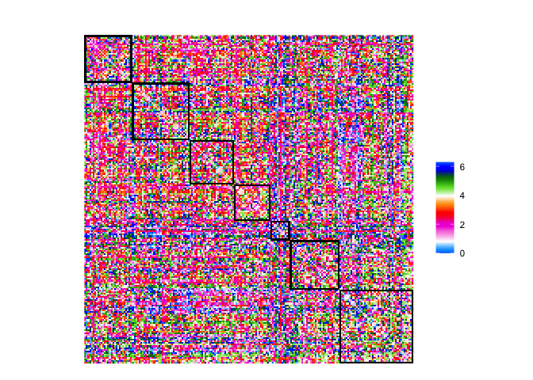<!-- -->

    ## [1] "No-GSR(30min): PipelineComp30min_cpac_abcd_all-cpac_fmriprep_all"

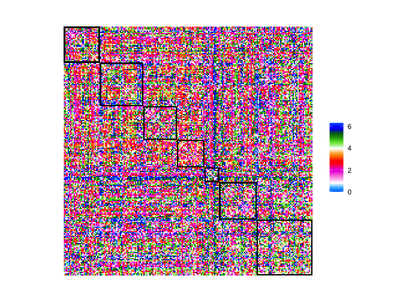<!-- -->

    ## [1] "No-GSR(30min): PipelineComp30min_cpac_abcd_all-cpac_ccs_all"

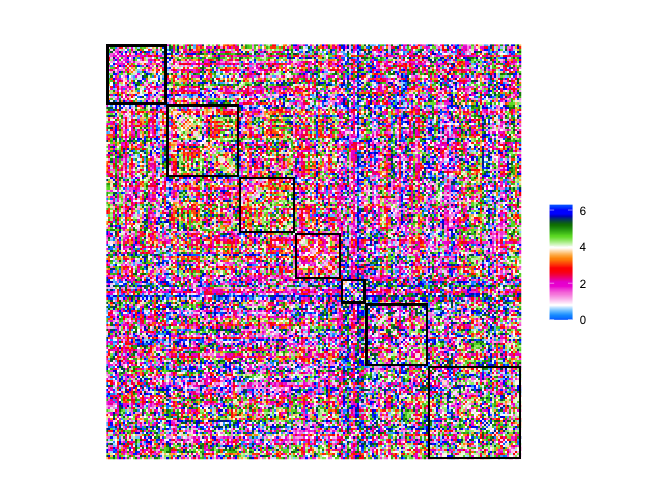<!-- -->
