Application example 3
================
Ting Xu (github: tingsterx/reliability_explorer)
2022-07-08

### Examine the reliability and individual varition across fMRI pipelines

This application example compares the reliability and individual
varition across four conventional fMRI pipelines including
[fMRIPrep](https://fmriprep.org/en/stable/),
[ABCD](https://www.biorxiv.org/content/10.1101/2021.07.09.451638v1),
[CCS](https://www.sciencedirect.com/science/article/abs/pii/S2095927316305394)
and [C-PAC](https://fcp-indi.github.io/docs/latest/user/index) default.
The details are described in [Li et al.,
2019](https://www.biorxiv.org/content/10.1101/2021.12.01.470790v1)

Raw data: Consortium for Reliability and Reproducibility (CoRR) - [HNU
dataset](http://fcon_1000.projects.nitrc.org/indi/CoRR/html/hnu_1.html)

**Calculation using ReX**: The individual variation, ICC for each edge
(i.e. connectivity), and dbICC at the parcel and whole connectivity
level are calcualted using the code: icc_HNU_edgewise_ICC\_*.R,
icc_HNU_parcelwise_dbICC\_*.R, icc_HNU_AllConn_dbICC\_\*.R

``` r
knitr::opts_chunk$set(warning = FALSE, message = FALSE) 
library(rstudioapi)
library(ReX)
library(ggplot2)
library(data.table)
library(dplyr)
```

    ## 
    ## Attaching package: 'dplyr'

    ## The following objects are masked from 'package:data.table':
    ## 
    ##     between, first, last

    ## The following objects are masked from 'package:stats':
    ## 
    ##     filter, lag

    ## The following objects are masked from 'package:base':
    ## 
    ##     intersect, setdiff, setequal, union

``` r
library(ggseg)
library(ggsegSchaefer)
```

### Set path

``` r
setwd(dirname(getSourceEditorContext()$path))
source('func_plot_brain_matrix.R')
```

### Comparing fMRI pipelines among fMRIprep, CCS, ABCD, CPAC - parcelwise

``` r
data_dir <- file.path('Application3-5', 'results_cpac_HNU', 'ROI_Schaefer200', 'rex_dbICC_per_parcel')
out_dir <- file.path('Application3-5', 'results_cpac_HNU', 'ROI_Schaefer200', 'rex_dbICC_per_parcel_plot')

cmap = ReX::rgb2hex(ReX::colormap.gradient.flow())
atlas <- schaefer7_200$data
labels <- read.table(file.path('Application3-5', 'atlas', 'Schaefer2018_200Parcels_7Networks_labels_MatchedTo_ggseg.txt'), header = TRUE)[,1]

for (amount in c("10min", "30min")){
  fname <- paste0(data_dir, "/dbICC_parcelwise_pipeines_comp_", amount, ".csv")
  df_all <- fread(fname)
  # GSR
  pipeline_list <- c("cpac_default_all_gsr", "cpac_fmriprep_all_gsr", "cpac_ccs_all_gsr", "cpac_abcd_all_gsr")
  for (pipeline1 in pipeline_list){
    for (pipeline2 in pipeline_list){
      if (pipeline1!=pipeline2){
        prefix <- sprintf('%s__CompTo__%s', pipeline1, pipeline2)
        
        df <- df_all %>% filter(contrast == prefix)
        df4ggseg <-  tibble(region = labels, data=df$delta.theta_norm)
        
        p <- df4ggseg %>% 
          ggseg(mapping = aes(fill = data), atlas=schaefer7_200, position="stacked") +
          scale_fill_gradientn(colours = cmap, limits= c(0, 2*pi)) +
          guides(fill = guide_colorbar(barheight=5)) +
          labs(fill = "normalized changes") + annotate(geom="text",label=NULL)
        print(sprintf('GSR(%s): %s', amount, prefix))
        print(p)
        fname <- sprintf('%s/PipelineCompare%s__%s_parcelwise.png', out_dir, amount, prefix)
        ggsave(fname, device="png")
      }
    }
  }
  cat('-------------------------------------------------------\n')
  # No-GSR
  pipeline_list <- c("cpac_default_all", "cpac_fmriprep_all", "cpac_ccs_all", "cpac_abcd_all")
  for (pipeline1 in pipeline_list){
    for (pipeline2 in pipeline_list){
      if (pipeline1!=pipeline2){
        prefix <- sprintf('%s__CompTo__%s', pipeline1, pipeline2)
        
        df <- df_all %>% filter(contrast == prefix)
        df4ggseg <-  tibble(region = labels, data=df$delta.theta_norm)
        
        p <- df4ggseg %>% 
          ggseg(mapping = aes(fill = data), atlas=schaefer7_200, position="stacked") +
          scale_fill_gradientn(colours = cmap, limits= c(0, 2*pi)) +
          guides(fill = guide_colorbar(barheight=5)) +
          labs(fill = "normalized changes") + annotate(geom="text",label=NULL)
        print(sprintf('No-GSR(%s): %s', amount, prefix))
        print(p)
        fname <- sprintf('%s/PipelineCompare%s_%s_parcelwise.png', out_dir, amount, prefix)
        ggsave(fname, device="png")
      }
    }
  }
}
```

    ## [1] "GSR(10min): cpac_default_all_gsr__CompTo__cpac_fmriprep_all_gsr"

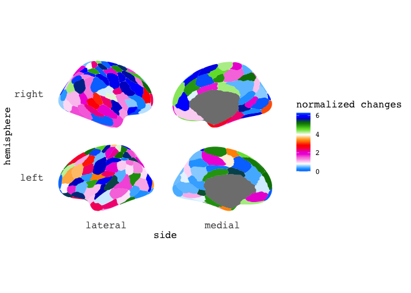<!-- -->

    ## [1] "GSR(10min): cpac_default_all_gsr__CompTo__cpac_ccs_all_gsr"

<!-- -->

    ## [1] "GSR(10min): cpac_default_all_gsr__CompTo__cpac_abcd_all_gsr"

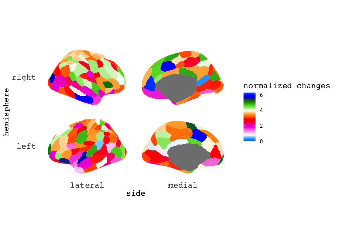<!-- -->

    ## [1] "GSR(10min): cpac_fmriprep_all_gsr__CompTo__cpac_default_all_gsr"

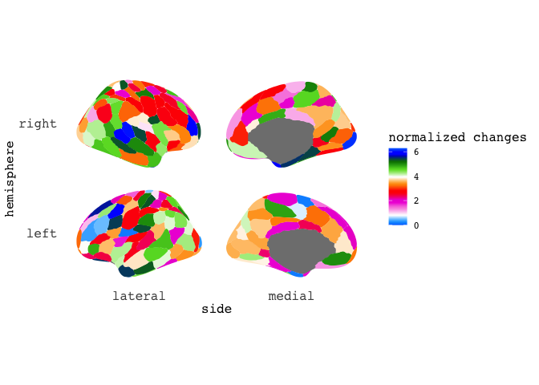<!-- -->

    ## [1] "GSR(10min): cpac_fmriprep_all_gsr__CompTo__cpac_ccs_all_gsr"

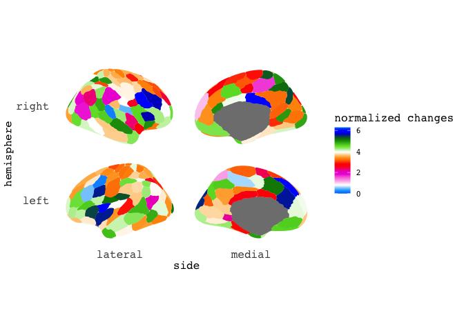<!-- -->

    ## [1] "GSR(10min): cpac_fmriprep_all_gsr__CompTo__cpac_abcd_all_gsr"

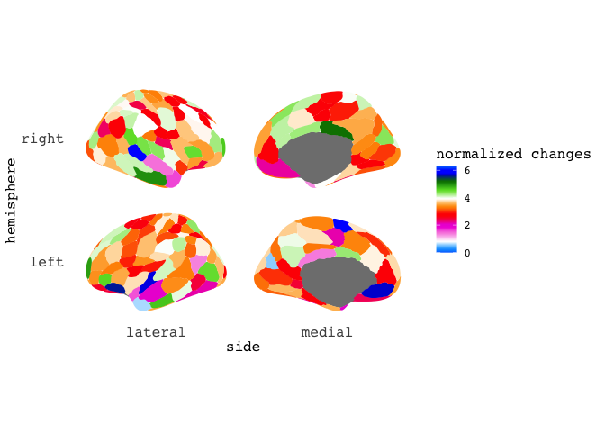<!-- -->

    ## [1] "GSR(10min): cpac_ccs_all_gsr__CompTo__cpac_default_all_gsr"

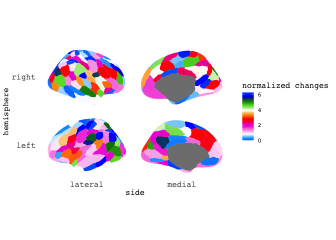<!-- -->

    ## [1] "GSR(10min): cpac_ccs_all_gsr__CompTo__cpac_fmriprep_all_gsr"

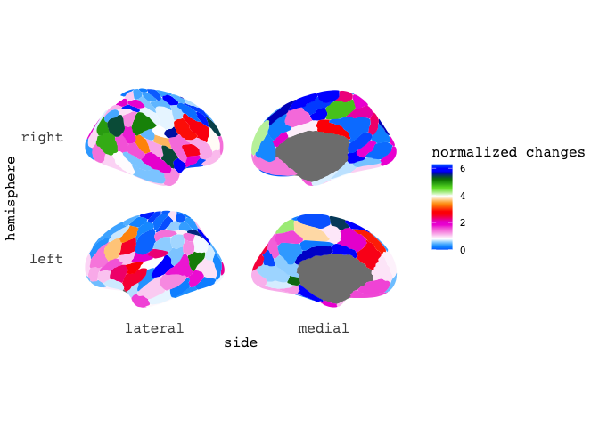<!-- -->

    ## [1] "GSR(10min): cpac_ccs_all_gsr__CompTo__cpac_abcd_all_gsr"

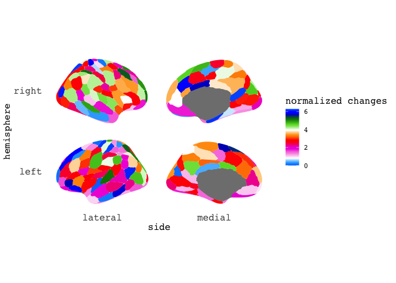<!-- -->

    ## [1] "GSR(10min): cpac_abcd_all_gsr__CompTo__cpac_default_all_gsr"

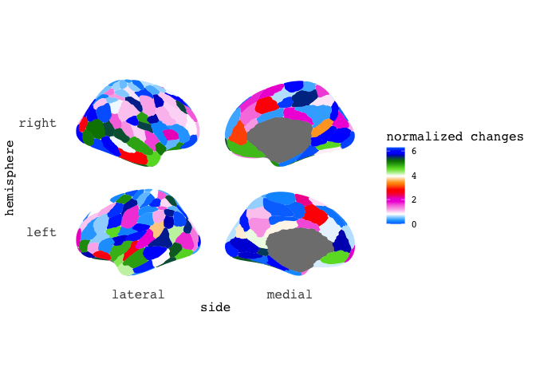<!-- -->

    ## [1] "GSR(10min): cpac_abcd_all_gsr__CompTo__cpac_fmriprep_all_gsr"

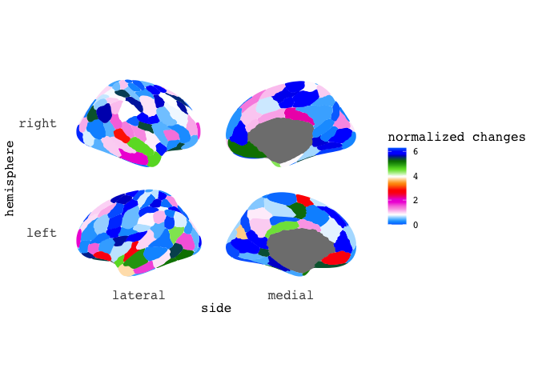<!-- -->

    ## [1] "GSR(10min): cpac_abcd_all_gsr__CompTo__cpac_ccs_all_gsr"

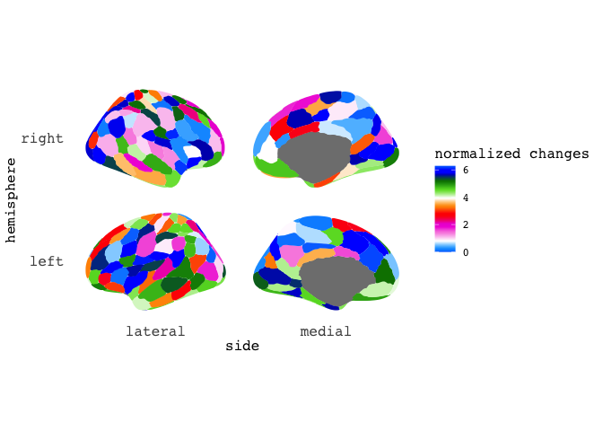<!-- -->

    ## -------------------------------------------------------
    ## [1] "No-GSR(10min): cpac_default_all__CompTo__cpac_fmriprep_all"

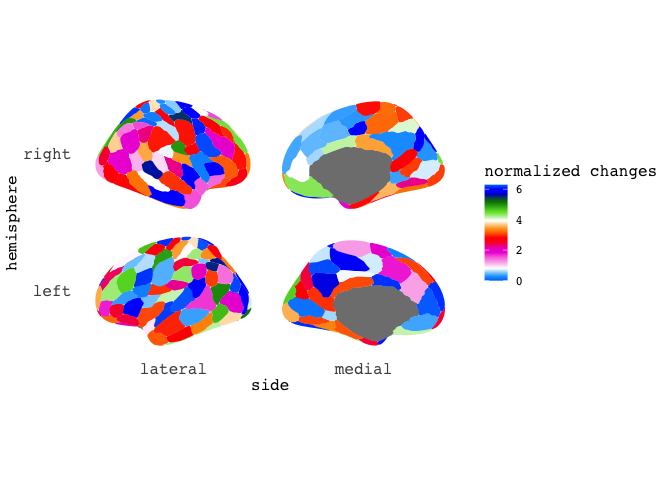<!-- -->

    ## [1] "No-GSR(10min): cpac_default_all__CompTo__cpac_ccs_all"

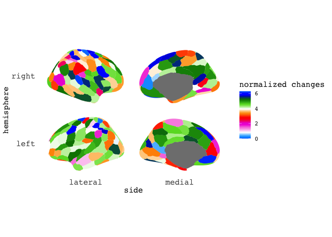<!-- -->

    ## [1] "No-GSR(10min): cpac_default_all__CompTo__cpac_abcd_all"

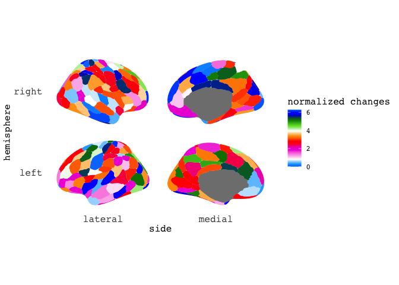<!-- -->

    ## [1] "No-GSR(10min): cpac_fmriprep_all__CompTo__cpac_default_all"

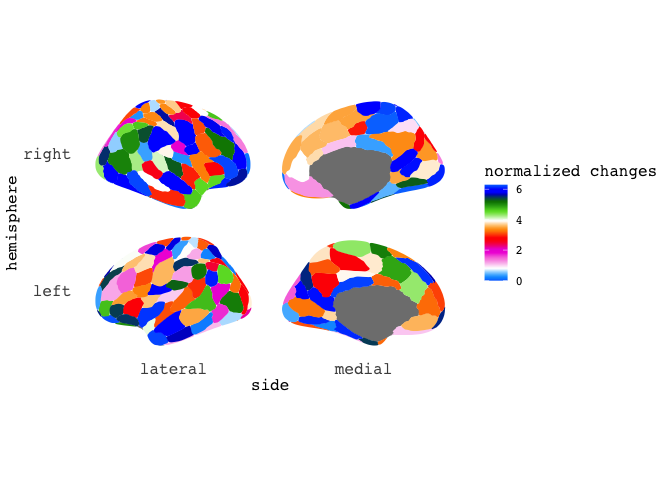<!-- -->

    ## [1] "No-GSR(10min): cpac_fmriprep_all__CompTo__cpac_ccs_all"

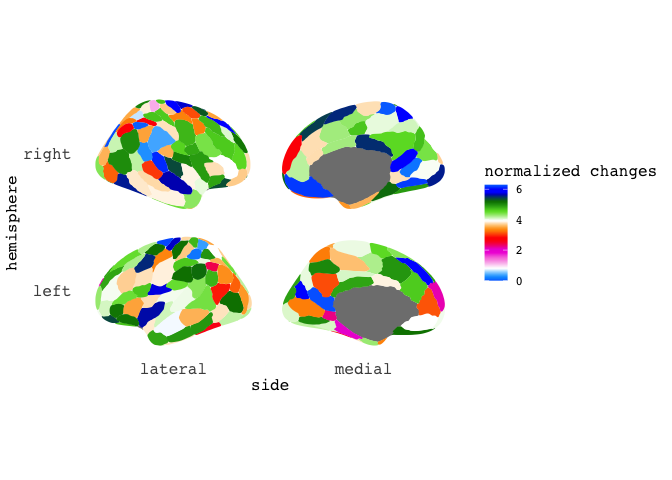<!-- -->

    ## [1] "No-GSR(10min): cpac_fmriprep_all__CompTo__cpac_abcd_all"

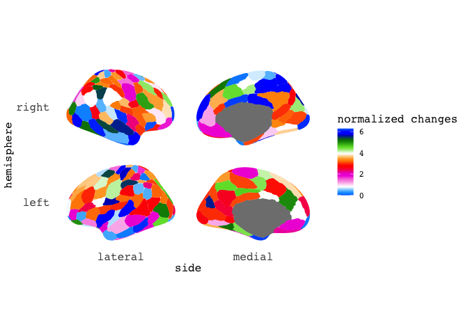<!-- -->

    ## [1] "No-GSR(10min): cpac_ccs_all__CompTo__cpac_default_all"

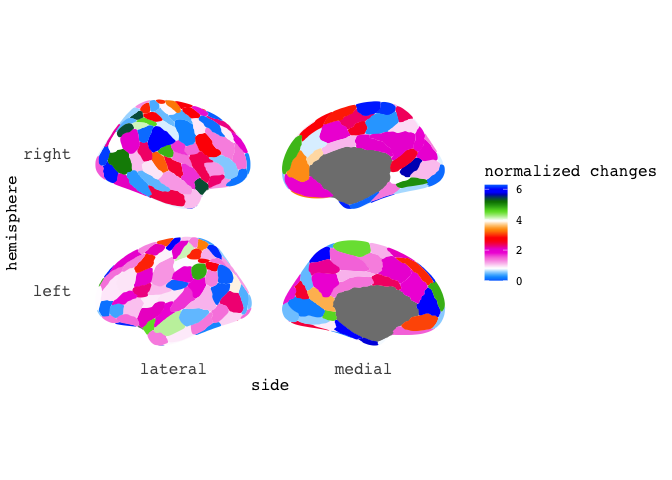<!-- -->

    ## [1] "No-GSR(10min): cpac_ccs_all__CompTo__cpac_fmriprep_all"

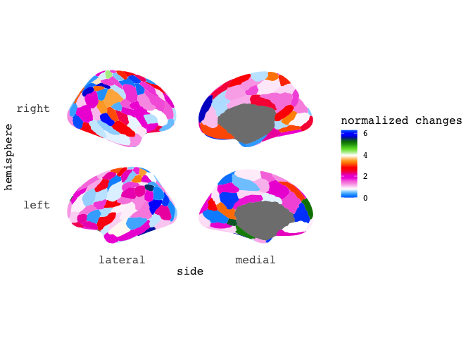<!-- -->

    ## [1] "No-GSR(10min): cpac_ccs_all__CompTo__cpac_abcd_all"

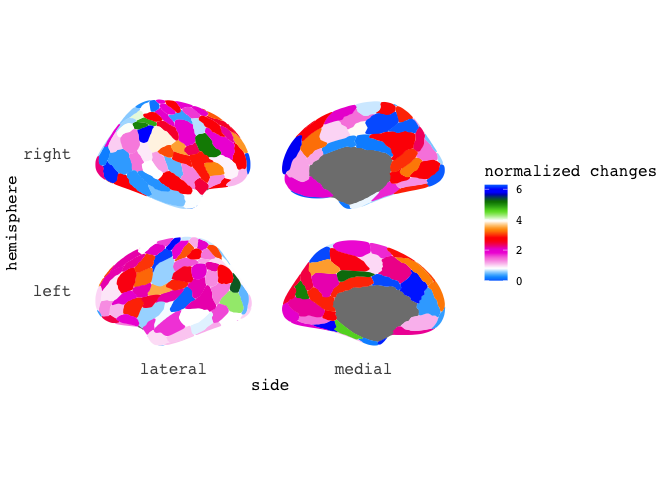<!-- -->

    ## [1] "No-GSR(10min): cpac_abcd_all__CompTo__cpac_default_all"

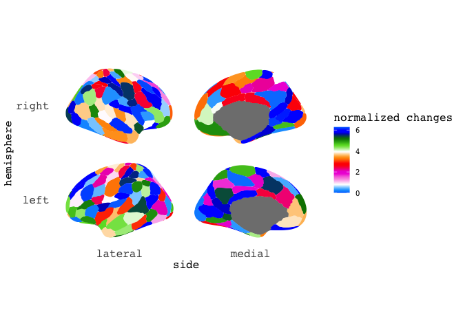<!-- -->

    ## [1] "No-GSR(10min): cpac_abcd_all__CompTo__cpac_fmriprep_all"

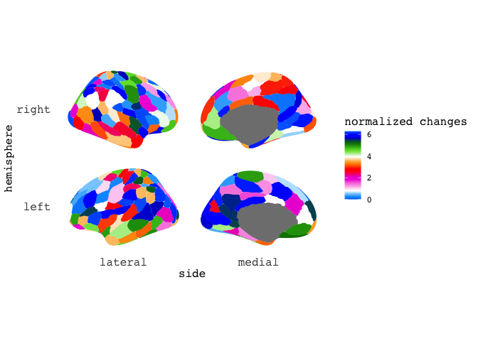<!-- -->

    ## [1] "No-GSR(10min): cpac_abcd_all__CompTo__cpac_ccs_all"

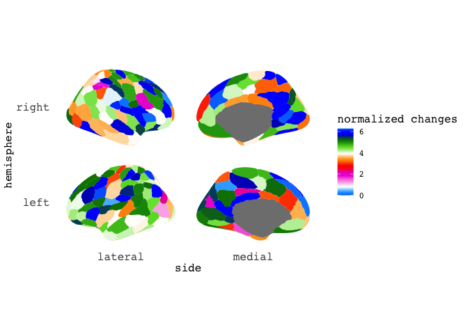<!-- -->

    ## [1] "GSR(30min): cpac_default_all_gsr__CompTo__cpac_fmriprep_all_gsr"

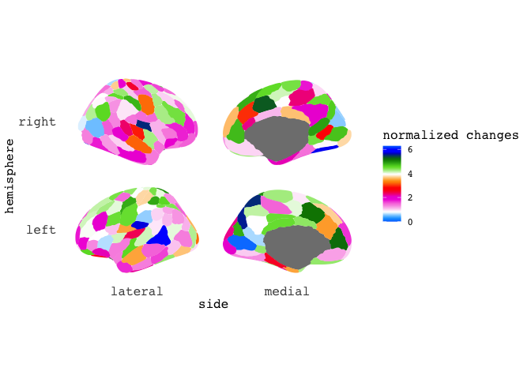<!-- -->

    ## [1] "GSR(30min): cpac_default_all_gsr__CompTo__cpac_ccs_all_gsr"

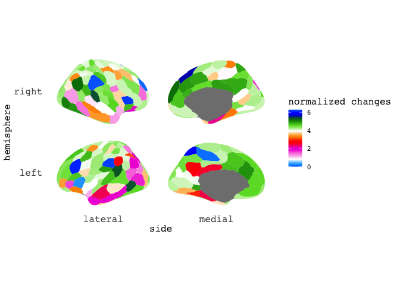<!-- -->

    ## [1] "GSR(30min): cpac_default_all_gsr__CompTo__cpac_abcd_all_gsr"

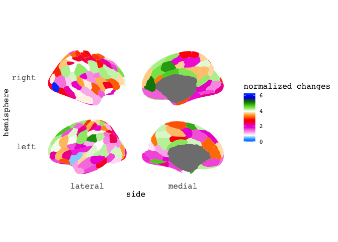<!-- -->

    ## [1] "GSR(30min): cpac_fmriprep_all_gsr__CompTo__cpac_default_all_gsr"

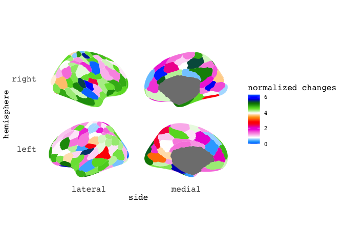<!-- -->

    ## [1] "GSR(30min): cpac_fmriprep_all_gsr__CompTo__cpac_ccs_all_gsr"

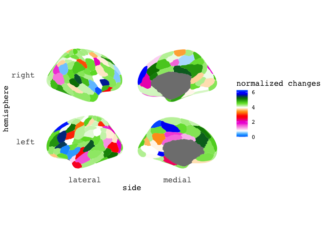<!-- -->

    ## [1] "GSR(30min): cpac_fmriprep_all_gsr__CompTo__cpac_abcd_all_gsr"

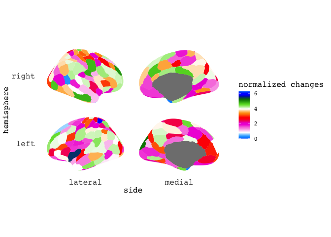<!-- -->

    ## [1] "GSR(30min): cpac_ccs_all_gsr__CompTo__cpac_default_all_gsr"

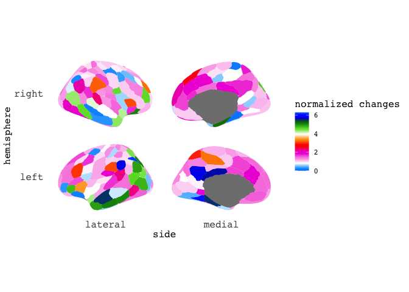<!-- -->

    ## [1] "GSR(30min): cpac_ccs_all_gsr__CompTo__cpac_fmriprep_all_gsr"

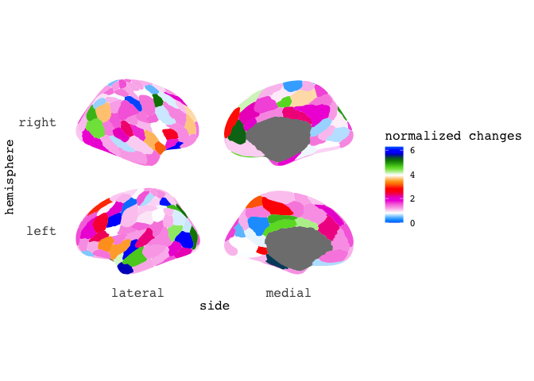<!-- -->

    ## [1] "GSR(30min): cpac_ccs_all_gsr__CompTo__cpac_abcd_all_gsr"

<!-- -->

    ## [1] "GSR(30min): cpac_abcd_all_gsr__CompTo__cpac_default_all_gsr"

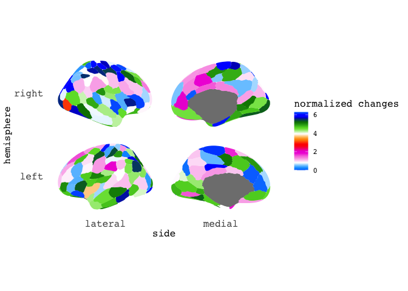<!-- -->

    ## [1] "GSR(30min): cpac_abcd_all_gsr__CompTo__cpac_fmriprep_all_gsr"

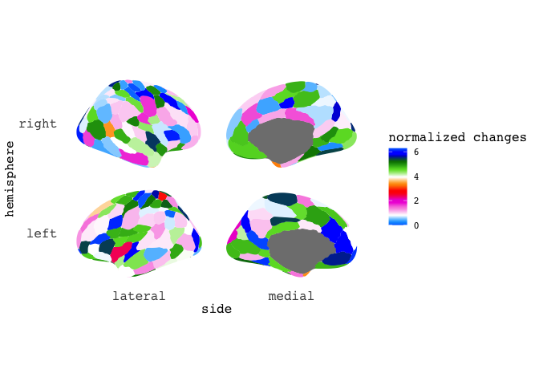<!-- -->

    ## [1] "GSR(30min): cpac_abcd_all_gsr__CompTo__cpac_ccs_all_gsr"

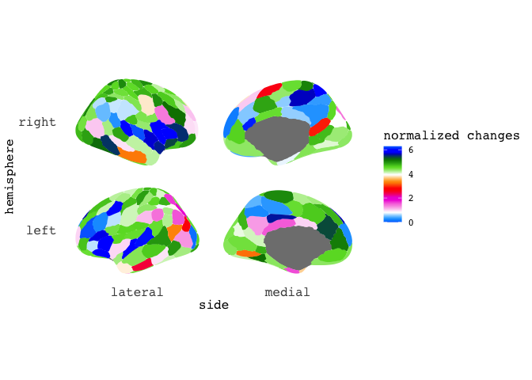<!-- -->

    ## -------------------------------------------------------
    ## [1] "No-GSR(30min): cpac_default_all__CompTo__cpac_fmriprep_all"

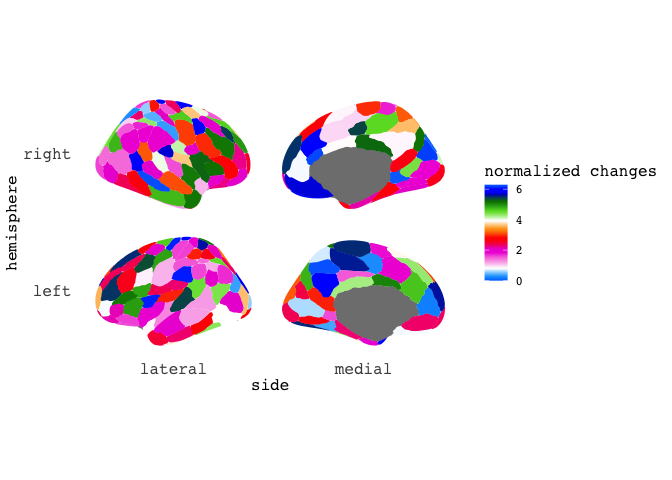<!-- -->

    ## [1] "No-GSR(30min): cpac_default_all__CompTo__cpac_ccs_all"

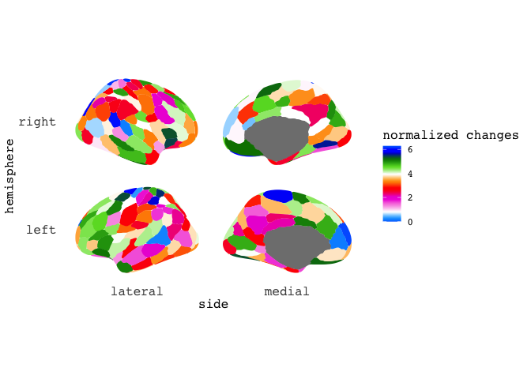<!-- -->

    ## [1] "No-GSR(30min): cpac_default_all__CompTo__cpac_abcd_all"

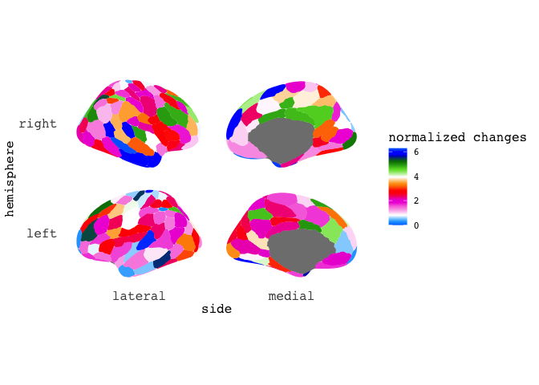<!-- -->

    ## [1] "No-GSR(30min): cpac_fmriprep_all__CompTo__cpac_default_all"

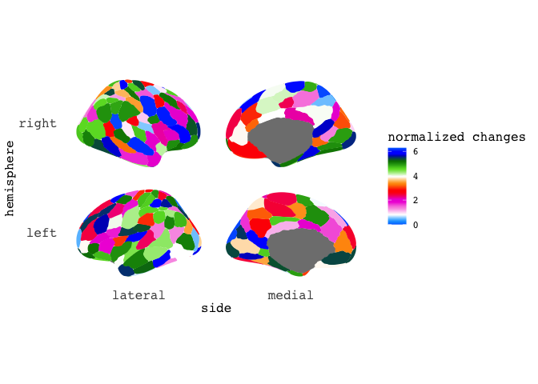<!-- -->

    ## [1] "No-GSR(30min): cpac_fmriprep_all__CompTo__cpac_ccs_all"

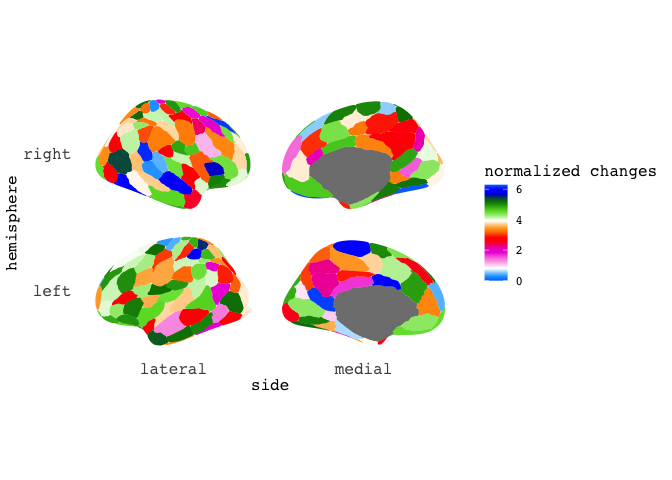<!-- -->

    ## [1] "No-GSR(30min): cpac_fmriprep_all__CompTo__cpac_abcd_all"

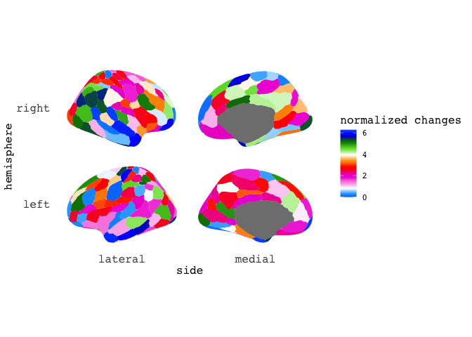<!-- -->

    ## [1] "No-GSR(30min): cpac_ccs_all__CompTo__cpac_default_all"

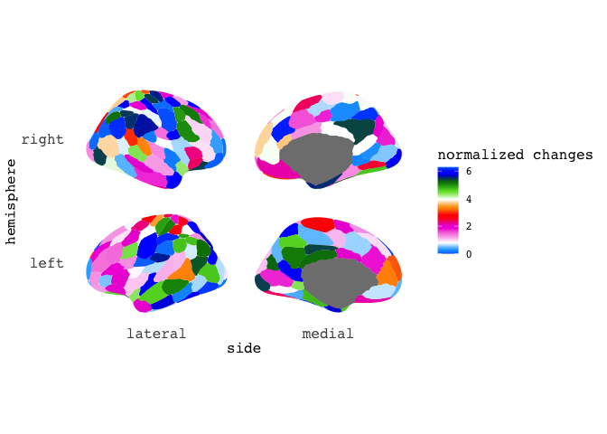<!-- -->

    ## [1] "No-GSR(30min): cpac_ccs_all__CompTo__cpac_fmriprep_all"

<!-- -->

    ## [1] "No-GSR(30min): cpac_ccs_all__CompTo__cpac_abcd_all"

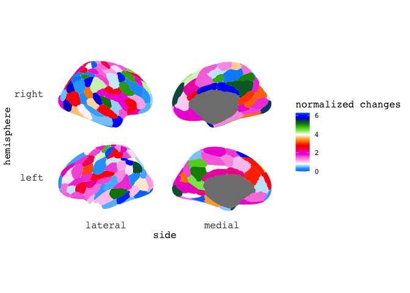<!-- -->

    ## [1] "No-GSR(30min): cpac_abcd_all__CompTo__cpac_default_all"

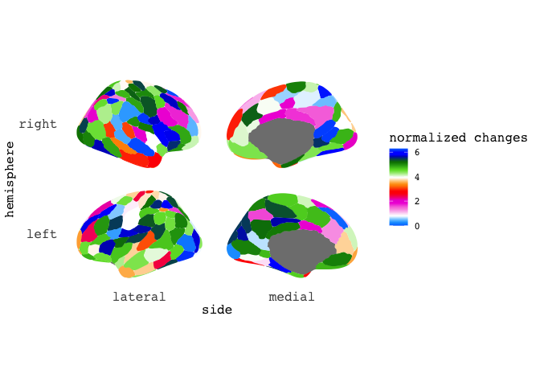<!-- -->

    ## [1] "No-GSR(30min): cpac_abcd_all__CompTo__cpac_fmriprep_all"

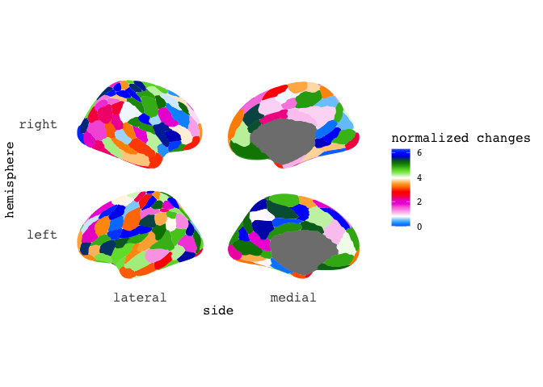<!-- -->

    ## [1] "No-GSR(30min): cpac_abcd_all__CompTo__cpac_ccs_all"

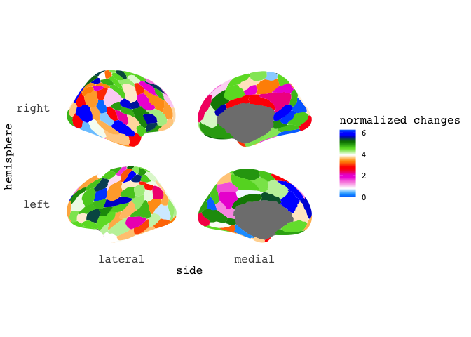<!-- -->
