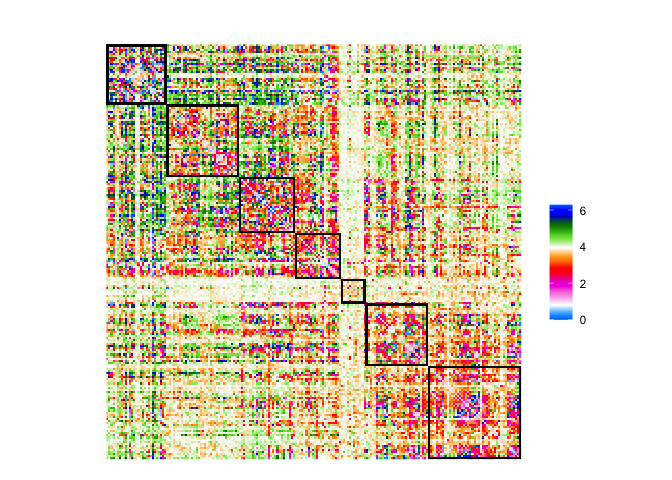
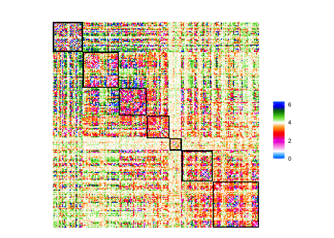
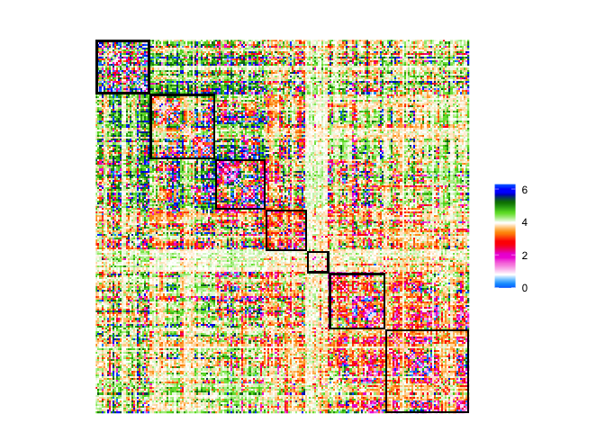
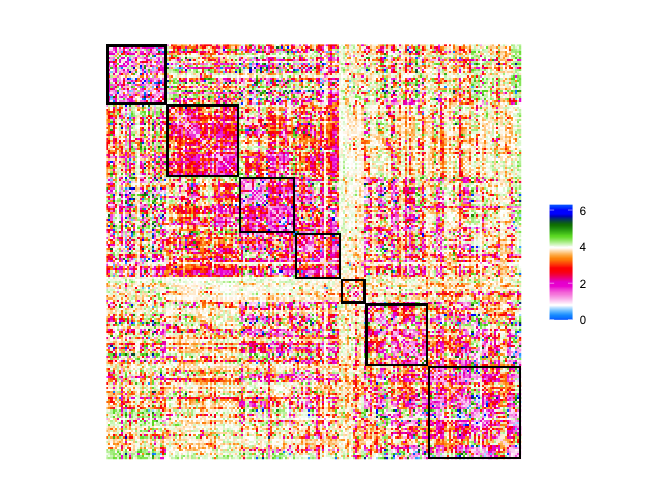
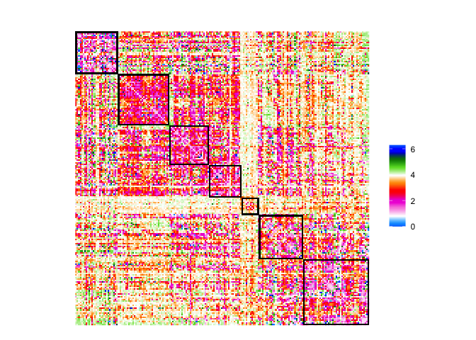
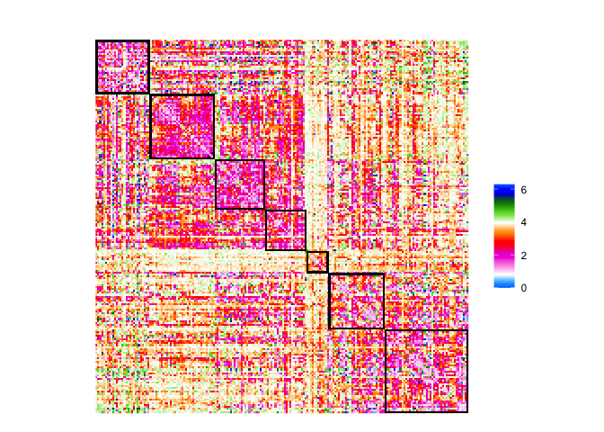
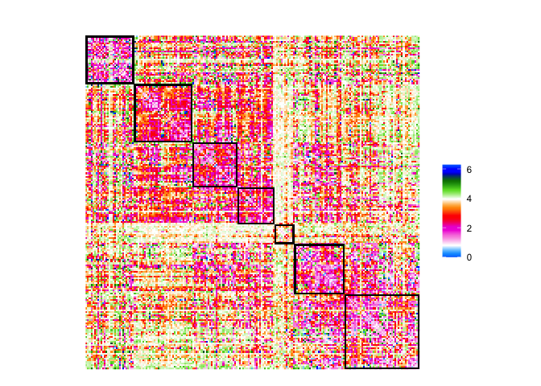

Application example 5
================
Ting Xu (github: tingsterx/reliability_explorer)
2022-07-08

### Examine the reliability and individual varition between pipelines with global signal regression (GSR) and without GSR

This application example compares the reliability and individual
varition across four conventional fMRI pipelines including
[fMRIPrep](https://fmriprep.org/en/stable/),
[ABCD](https://www.biorxiv.org/content/10.1101/2021.07.09.451638v1),
[CCS](https://www.sciencedirect.com/science/article/abs/pii/S2095927316305394)
and [C-PAC](https://fcp-indi.github.io/docs/latest/user/index) default.
The details are described in [Li et al.,
2019](https://www.biorxiv.org/content/10.1101/2021.12.01.470790v1)

Raw data: Consortium for Reliability and Reproducibility (CoRR) - [HNU
dataset](http://fcon_1000.projects.nitrc.org/indi/CoRR/html/hnu_1.html)

**Calculation using ReX**: The individual variation, ICC for each edge
(i.e. connectivity), and dbICC at the parcel and whole connectivity
level are calcualted using the code: icc_HNU_edgewise_ICC\_*.R,
icc_HNU_parcelwise_dbICC\_*.R, icc_HNU_AllConn_dbICC\_\*.R

``` r
knitr::opts_chunk$set(warning = FALSE, message = FALSE) 
library(rstudioapi)
library(ReX)
library(ggplot2)
library(data.table)
library(dplyr)
```

    ## 
    ## Attaching package: 'dplyr'

    ## The following objects are masked from 'package:data.table':
    ## 
    ##     between, first, last

    ## The following objects are masked from 'package:stats':
    ## 
    ##     filter, lag

    ## The following objects are masked from 'package:base':
    ## 
    ##     intersect, setdiff, setequal, union

``` r
library(ggseg)
library(ggsegSchaefer)
```

### Set path

``` r
setwd(dirname(getSourceEditorContext()$path))
source('func_plot_brain_matrix.R')
```

### Comparing pipeline with GSR and without GSR for each of four pipelines (fMRIprep, CCS, ABCD, CPAC)

``` r
data_dir <- file.path('Application3-5', 'results_cpac_HNU', 'ROI_Schaefer200')
out_dir <- file.path('Application3-5', 'results_cpac_HNU', 'ROI_Schaefer200', 'rex_icc_comp_matrix')

# Schaefer200 label2Yeo7Network
labels2Yeo <- read.table(file.path('Application3-5', 'atlas', 'Schaefer2018_200Parcels_7Networks_labels_MatchedTo_ggseg.txt'), header=TRUE)$Yeo
Nparcel <- 200

cmap <- ReX::rgb2hex(ReX::colormap.gradient.flow())
pipeline_list <- c("cpac_default_all",  "cpac_fmriprep_all",  "cpac_ccs_all", "cpac_abcd_all")

for (amount in c("10min", "30min")){
  for (pipeline in pipeline_list){

    prefix <- sprintf('GSR-NOGSR_%s_%s', amount, pipeline)
    fname <- sprintf('%s/rex_icc_comp/%s_ReX_CompareICC_Results.csv', data_dir, prefix)
    df <- fread(fname)
    
    M <- matrix(0, Nparcel, Nparcel)
    M[upper.tri(M)] <- df$delta.theta_norm
    M <- M + t(M) + diag(1, Nparcel)
    M <- M[order(labels2Yeo), order(labels2Yeo)]
    
    print(sprintf('GSR(%s): %s', amount, prefix))
    p <- plot_matrix_Schaefer7_200(M, cmap)
    print(p)
    fname <- sprintf('%s/%s_ReX_CompareICC_ChangeOfVariation_Normalized_GradientFlow.png', out_dir, prefix)
    ggsave(fname, device="png")
  }
}
```

    ## [1] "GSR(10min): GSR-NOGSR_10min_cpac_default_all"

<!-- -->

    ## [1] "GSR(10min): GSR-NOGSR_10min_cpac_fmriprep_all"

<!-- -->

    ## [1] "GSR(10min): GSR-NOGSR_10min_cpac_ccs_all"

<!-- -->

    ## [1] "GSR(10min): GSR-NOGSR_10min_cpac_abcd_all"

<!-- -->

    ## [1] "GSR(30min): GSR-NOGSR_30min_cpac_default_all"

<!-- -->

    ## [1] "GSR(30min): GSR-NOGSR_30min_cpac_fmriprep_all"

<!-- -->

    ## [1] "GSR(30min): GSR-NOGSR_30min_cpac_ccs_all"

<!-- -->

    ## [1] "GSR(30min): GSR-NOGSR_30min_cpac_abcd_all"

<!-- -->
