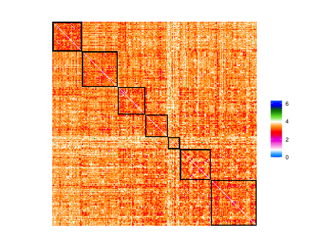
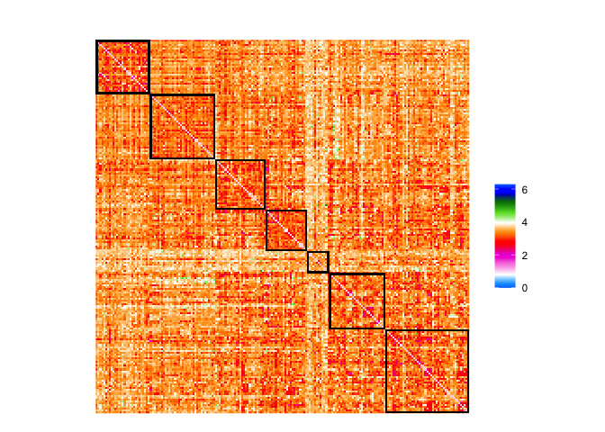
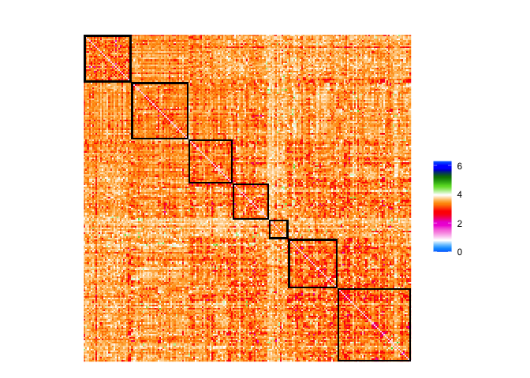
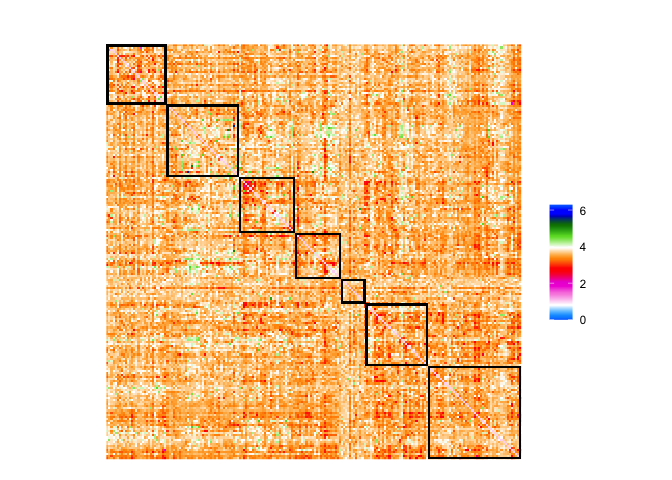
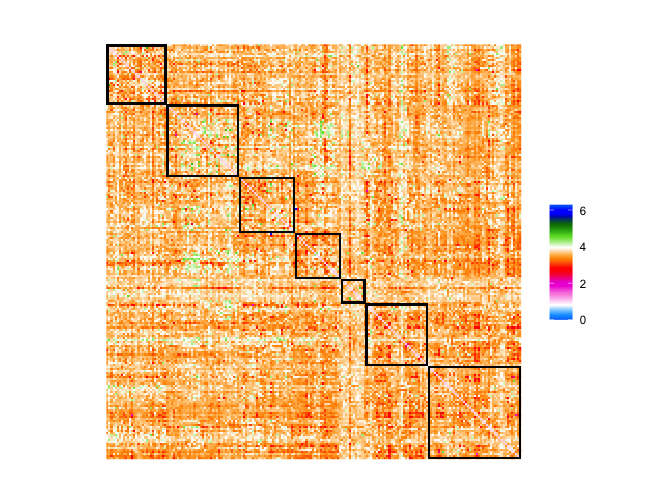
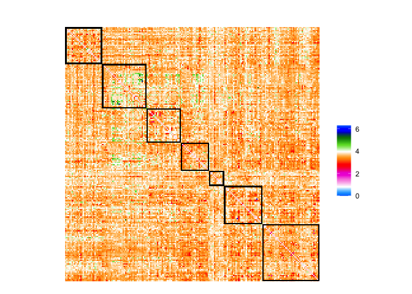
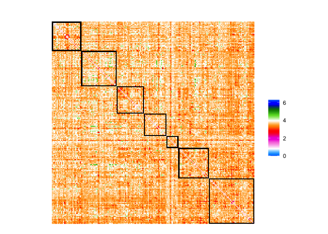

Application example 5
================
Ting Xu (github: tingsterx/reliability_explorer)
2022-07-08

### Examine the reliability and individual varition of 30 min vs 10 min data

This application example compares the reliability and individual
varition across four conventional fMRI pipelines including
[fMRIPrep](https://fmriprep.org/en/stable/),
[ABCD](https://www.biorxiv.org/content/10.1101/2021.07.09.451638v1),
[CCS](https://www.sciencedirect.com/science/article/abs/pii/S2095927316305394)
and [C-PAC](https://fcp-indi.github.io/docs/latest/user/index) default.
The details are described in [Li et al.,
2019](https://www.biorxiv.org/content/10.1101/2021.12.01.470790v1)

Raw data: Consortium for Reliability and Reproducibility (CoRR) - [HNU
dataset](http://fcon_1000.projects.nitrc.org/indi/CoRR/html/hnu_1.html)

**Calculation using ReX**: The individual variation, ICC for each edge
(i.e. connectivity), and dbICC at the parcel and whole connectivity
level are calcualted using the code: icc_HNU_edgewise_ICC\_*.R,
icc_HNU_parcelwise_dbICC\_*.R, icc_HNU_AllConn_dbICC\_\*.R

``` r
knitr::opts_chunk$set(warning = FALSE, message = FALSE) 
library(rstudioapi)
library(ReX)
library(ggplot2)
library(data.table)
library(dplyr)
```

    ## 
    ## Attaching package: 'dplyr'

    ## The following objects are masked from 'package:data.table':
    ## 
    ##     between, first, last

    ## The following objects are masked from 'package:stats':
    ## 
    ##     filter, lag

    ## The following objects are masked from 'package:base':
    ## 
    ##     intersect, setdiff, setequal, union

``` r
library(ggseg)
library(ggsegSchaefer)
```

### Set path

``` r
setwd(dirname(getSourceEditorContext()$path))
source('func_plot_brain_matrix.R')
```

### Comparing fMRI pipelines: 30min vs 10min

``` r
data_dir <- file.path('Application3-5', 'results_cpac_HNU', 'ROI_Schaefer200')
out_dir <- file.path('Application3-5', 'results_cpac_HNU', 'ROI_Schaefer200', 'edgewise_result_matrix')

# Schaefer200 label2Yeo7Network
labels2Yeo <- read.table(file.path('Application3-5', 'atlas', 'Schaefer2018_200Parcels_7Networks_labels_MatchedTo_ggseg.txt'), header=TRUE)$Yeo
Nparcel <- 200
# Gradient flow colormap
cmap <- ReX::rgb2hex(ReX::colormap.gradient.flow())

# 30min vs 10min - pipeline with GSR
pipeline_list <- c("cpac_default_all_gsr", "cpac_fmriprep_all_gsr", "cpac_ccs_all_gsr", "cpac_abcd_all_gsr")
for (pipeline in pipeline_list){
  fname <- paste0(data_dir, "/rex_icc_comp/30min-10min_", pipeline ,"_ReX_CompareICC_Results.csv")
  df <- fread(fname)
  
  M <- matrix(0, Nparcel, Nparcel)
  M[upper.tri(M)] <- df$delta.theta_norm
  M <- M + t(M) + diag(1, Nparcel)
  M <- M[order(labels2Yeo), order(labels2Yeo)]
  
  print(sprintf('30min vs 10min: %s', pipeline))
  p <- plot_matrix_Schaefer7_200(M, cmap)
  print(p)
  fname <- sprintf('%s/rex_plot_normalized_change__compare_30min-10min__%s__edgewise_matrix.png', out_dir, pipeline)
  ggsave(fname, device="png")
}
```

    ## [1] "30min vs 10min: cpac_default_all_gsr"

<!-- -->

    ## [1] "30min vs 10min: cpac_fmriprep_all_gsr"

<!-- -->

    ## [1] "30min vs 10min: cpac_ccs_all_gsr"

<!-- -->

    ## [1] "30min vs 10min: cpac_abcd_all_gsr"

<!-- -->

``` r
# 30min vs 10min - pipeline without GSR
pipeline_list <- c("cpac_default_all",  "cpac_fmriprep_all",  "cpac_ccs_all", "cpac_abcd_all")
for (pipeline in pipeline_list){
  fname <- paste0(data_dir, "/rex_icc_comp/30min-10min_", pipeline ,"_ReX_CompareICC_Results.csv")
  df <- fread(fname)
  
  M <- matrix(0, Nparcel, Nparcel)
  M[upper.tri(M)] <- df$delta.theta_norm
  M <- M + t(M) + diag(1, Nparcel)
  M <- M[order(labels2Yeo), order(labels2Yeo)]
  
  print(sprintf('30min vs 10min: %s', pipeline))
  p <- plot_matrix_Schaefer7_200(M, cmap)
  print(p)
  fname <- sprintf('%s/rex_plot_normalized_change__compare_30min-10min__%s__edgewise_matrix.png', out_dir, pipeline)
  ggsave(fname, device="png")
}
```

    ## [1] "30min vs 10min: cpac_default_all"

<!-- -->

    ## [1] "30min vs 10min: cpac_fmriprep_all"

<!-- -->

    ## [1] "30min vs 10min: cpac_ccs_all"

<!-- -->

    ## [1] "30min vs 10min: cpac_abcd_all"

<!-- -->
