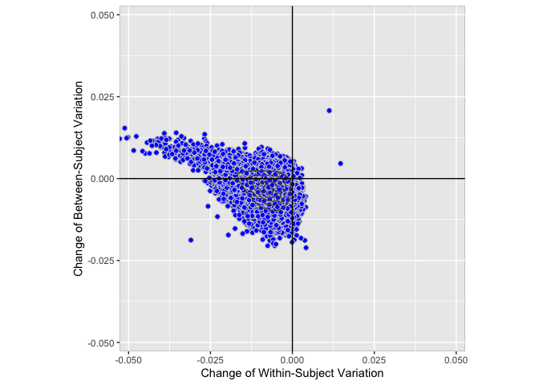
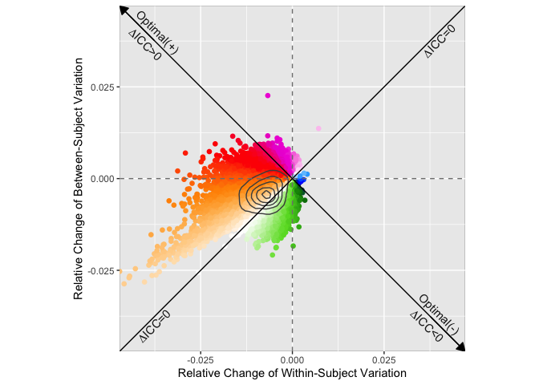
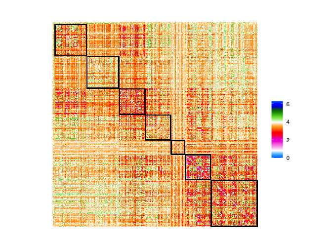

Application example 6
================
Ting Xu (github: tingsterx/reliability_explorer)
2022-07-08

### Comparing data aggregration strategies: A single long scan vs multiple shorter scans

How to obtain the desired amounts of data per participant is one of the
challenges in the fMRI design. The same amount of data can be collected
within a single long scan or multiple shorter scans data concatenation.
Our previous study has demonstrated that concatenating multiple shorter
scans had a clear advantage over a single long scan when the total
number of time points is equal (Cho et al., 2021). This example used the
data in our previous study and evaluated the change of variation between
these two aggregration strategies.

**Note**: The original HCP data is not enclosed but available via the
HCP (<https://db.humanconnectome.org/>).

Reference: [Cho et al., 2021. Impact of concatenating fMRI data on
reliability for functional connectomics.
NeuroImage](https://www.sciencedirect.com/science/article/pii/S105381192031034X)

## comparing data aggregration strategy

``` r
knitr::opts_chunk$set(warning = FALSE, message = FALSE) 
library(rstudioapi)
library(data.table)
library(dplyr)
```

    ## 
    ## Attaching package: 'dplyr'

    ## The following objects are masked from 'package:data.table':
    ## 
    ##     between, first, last

    ## The following objects are masked from 'package:stats':
    ## 
    ##     filter, lag

    ## The following objects are masked from 'package:base':
    ## 
    ##     intersect, setdiff, setequal, union

``` r
library(ReX)
library(ggplot2)
```

### Set path

``` r
setwd(dirname(getSourceEditorContext()$path))
source('func_plot_brain_matrix.R')
data_dir <- file.path('Application6', 'data')
out_dir <- file.path('Application6', 'results')
```

### Data

Concatenate (two shorter scans): 2subsets_concatenate_600TR_x\_2segment

Continuous (a single long scans):
2subsets_continuous_Day1_LR_and_Day1_RL

**Note**: The HCP data is not enclosed here but available via the HCP
(<https://db.humanconnectome.org/>).

### calcualte reliability, individual variation

    data_name <- '2subsets_continuous_Day1_LR_and_Day1_RL'
    fname <- paste0(data_dir, '/', data_name, '/icc_in_mat.mat')
    mat <- R.matlab::readMat(fname, header=TRUE)
    data <- as.matrix(mat$AllData)
    subID <- as.matrix(mat$sID)
    session <- rep(c(1,2), times=mat$nSubj)
    cov <- as.matrix(cbind(mat$CovB, mat$CovW))
    df_icc <- data.frame(lme_ICC_1wayR(data, subID, session, cov))
    fout <- paste0(out_dir, '/icc_1wayR__', data_name, '.csv')
    fwrite(df_icc, fout)

    data_name <- '2subsets_concatenate_600TR_x_2segment'
    fname <- paste0(data_dir, '/', data_name, '/icc_in_mat.mat')
    mat <- R.matlab::readMat(fname, header=TRUE)
    data <- as.matrix(mat$AllData)
    subID <- as.matrix(mat$sID)
    session <- rep(c(1,2), times=mat$nSubj)
    cov <- as.matrix(cbind(mat$CovB, mat$CovW))
    df_icc <- data.frame(lme_ICC_1wayR(data, subID, session, cov))
    fout <- paste0(out_dir, '/icc_1wayR__', data_name, '.csv')
    fwrite(df_icc, fout)

### load the reliability, individual variation for both strategies

``` r
fname <- paste0(out_dir, '/icc_1wayR__2subsets_continuous_Day1_LR_and_Day1_RL.csv')
df_icc1 <- fread(fname)
df_icc1$group <- '1 single 14.4min scan'
fname <- paste0(out_dir, '/icc_1wayR__2subsets_concatenate_600TR_x_2segment.csv')
df_icc2 <- fread(fname)
df_icc2$group <- '2 7.2min scans'
df_icc <- rbind(df_icc1, df_icc2)
```

### plot the individual variation in a variation field map for both strategies

``` r
p <- rex_plot.var.field.n(df_icc, group.name = "group", size.point = 1,
                          plot.density=TRUE, show.contour = TRUE, color.point.border = NULL)
p
```

<!-- -->

``` r
fname <- paste0(out_dir, '/demo_rex_plot_var_field.n__continuous_and_concatenate.pdf')
ggsave(fname, device="pdf")
```

### comparing individual variation and calcualte the gradient flow score - concatenated vs continuous

``` r
df_baseline <- df_icc1
df_target <- df_icc2
df_paired <- cbind(df_baseline, df_target)
# calculate the normalized changes of variation - gradient flow 
df_VarPairedComp <- icc_gradient_flow(df_target$sigma2_w, df_target$sigma2_b, df_baseline$sigma2_w, df_baseline$sigma2_b)
df_VarPairedComp$contrast <- "two short scans vs a single long scans"
rownames(df_VarPairedComp) <- df_paired$X
head(df_VarPairedComp)
```

    ##   delta.sigma2_w delta.sigma2_b delta.theta delta.sigma2_w_norm
    ## 1  -0.0015359945  -0.0034061470    4.288747       -2.306832e-03
    ## 2  -0.0037538037  -0.0019109433    3.612469       -4.062758e-03
    ## 3  -0.0021031437   0.0003140152    2.993380       -2.025687e-03
    ## 4   0.0000761298  -0.0003486541    4.927368       -3.252945e-05
    ## 5  -0.0003945350  -0.0012567134    4.408191       -6.475806e-04
    ## 6  -0.0015104817  -0.0006021869    3.520954       -1.544194e-03
    ##   delta.sigma2_b_norm delta.theta_norm                               contrast
    ## 1       -0.0029393267         4.046975 two short scans vs a single long scans
    ## 2       -0.0011120890         3.408776 two short scans vs a single long scans
    ## 3        0.0006468470         2.832505 two short scans vs a single long scans
    ## 4       -0.0003553833         4.621110 two short scans vs a single long scans
    ## 5       -0.0011470074         4.198419 two short scans vs a single long scans
    ## 6       -0.0005095588         3.460326 two short scans vs a single long scans

``` r
fname <- paste0(out_dir, '/demo_rex_plot_change__concatenate_vs_continuous.csv')
fwrite(df_VarPairedComp, fname)
```

``` r
fname <- paste0(out_dir, '/demo_rex_plot_change__concatenate_vs_continuous.csv')
df_VarPairedComp <- fread(fname)

p <- rex_plot.var.change(df_VarPairedComp)
p
```

<!-- -->

``` r
fname <- paste0(out_dir, '/demo_rex_plot_change__concatenate_vs_continuous.pdf')
ggsave(fname, device="pdf")
p <- rex_plot.icc.gradient.norm(df_VarPairedComp)
p
```

<!-- -->

``` r
fname <- paste0(out_dir, '/demo_rex_plot_normalized_change__concatenate_vs_continuous.pdf')
ggsave(fname, device="pdf")
```

### plot the normalized change of individual varation (gradient flow score) - concatenated vs continuous

``` r
# Glasser
Yeo7Network_keys <- read.csv('Application6/HCPMMP_To_Yeo7_LR.csv')$Yeo7Network_keys

Nparcel <- 360
M <- matrix(0, Nparcel, Nparcel)
M[upper.tri(M)] <- df_VarPairedComp$delta.theta_norm
M <- M + t(M) + diag(1, Nparcel)

M <- M[order(Yeo7Network_keys), order(Yeo7Network_keys)]

cmap = ReX::rgb2hex(ReX::colormap.gradient.flow())

plot_matrix_Glasser(M, cmap)
```

<!-- -->

``` r
fname <- paste0(out_dir, '/demo_rex_plot_normalized_change__concatenate_vs_continuous_Matrix.png')
ggsave(fname, device="png")
```
