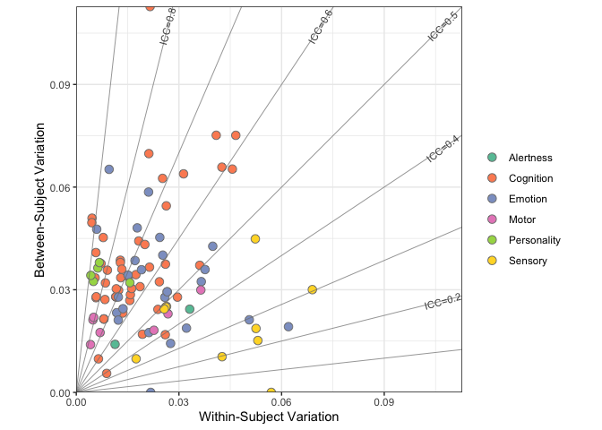
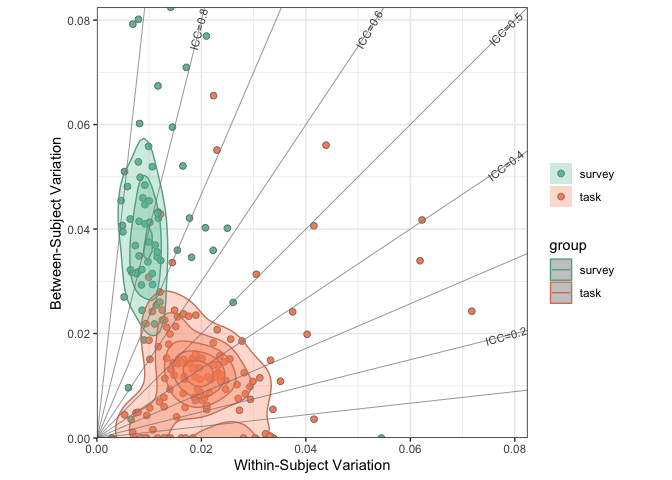
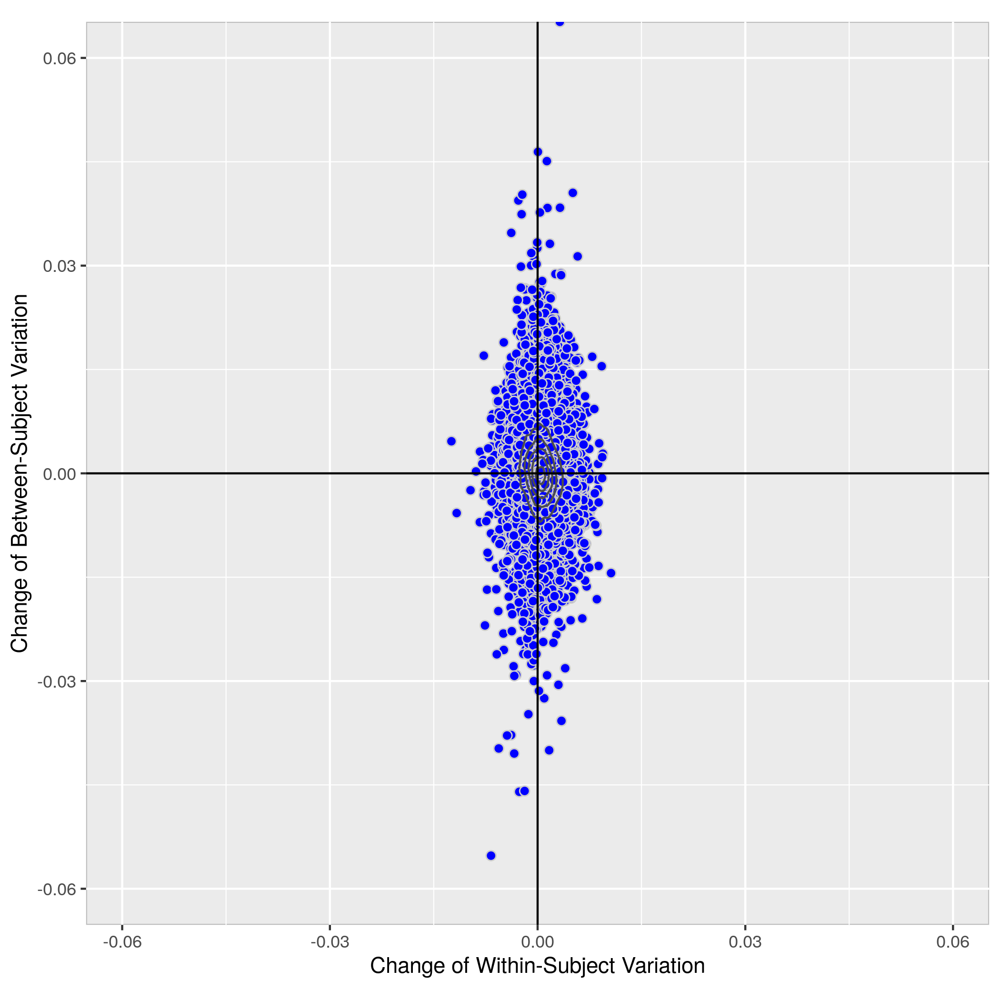
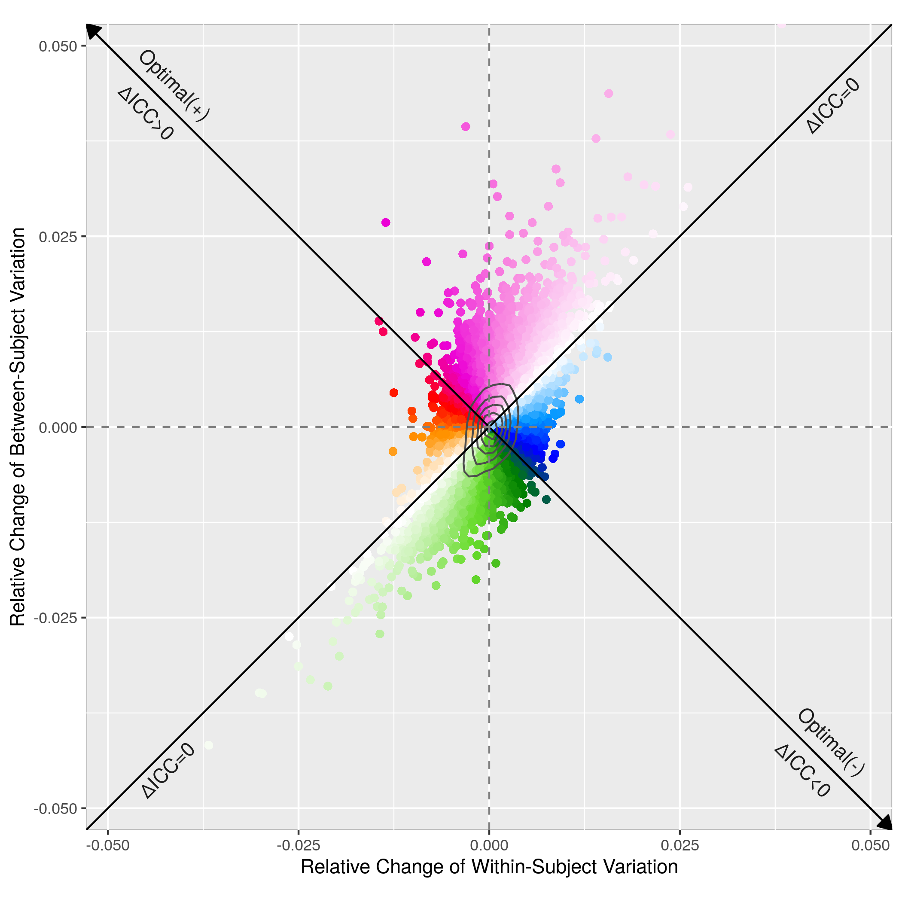
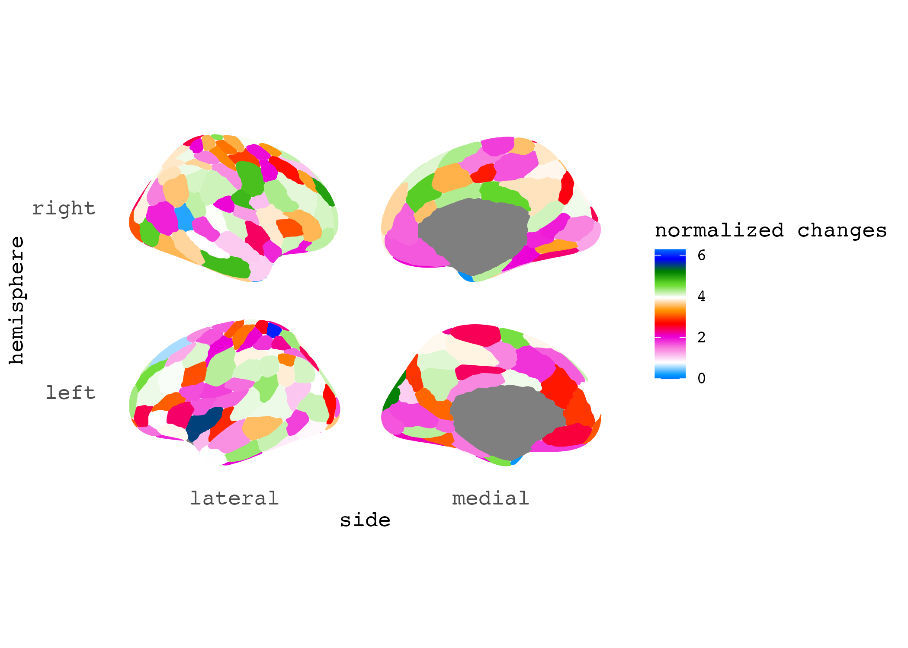
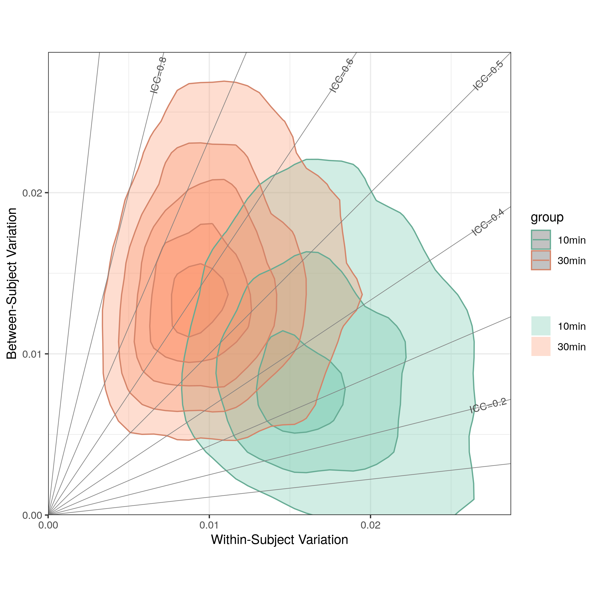
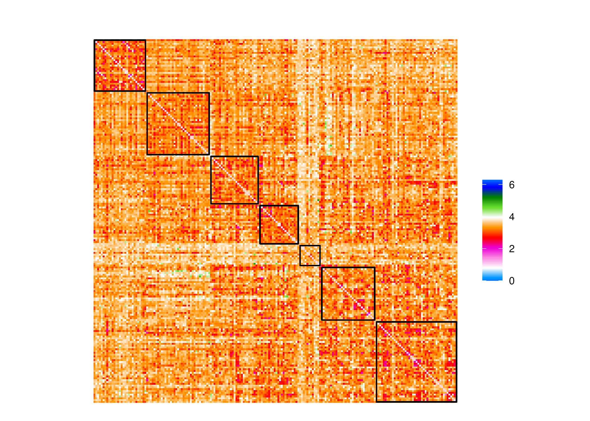
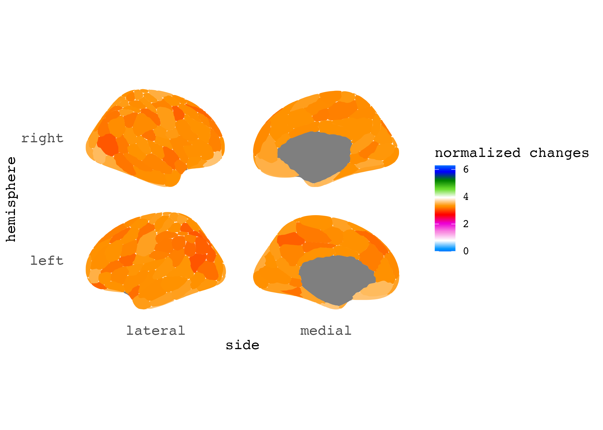
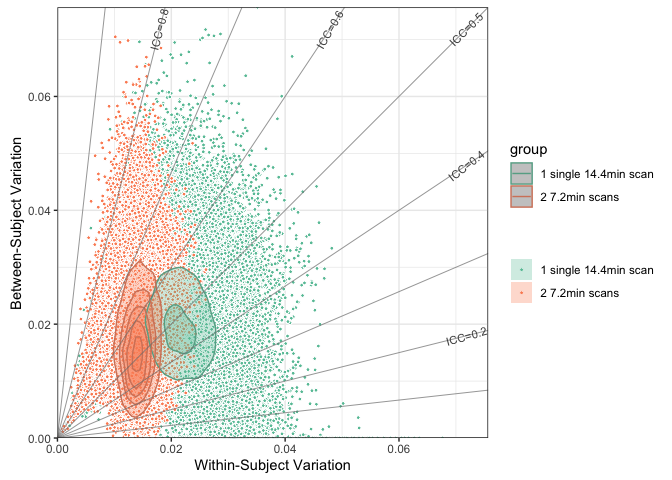

## Applications examples 

- Application 1: Behavioral tests in Human Connectome Project 
- Application 2: Task vs survey comparison for measuring self-regulation (ref: [Enkavi et al.,
2019](https://www.pnas.org/doi/pdf/10.1073/pnas.1818430116))
- Application 3: fMRI pipelines comparision ([fMRIPrep](https://fmriprep.org/en/stable/),
[ABCD](https://www.biorxiv.org/content/10.1101/2021.07.09.451638v1),
[CCS](https://www.sciencedirect.com/science/article/abs/pii/S2095927316305394)
[C-PAC](https://fcp-indi.github.io/docs/latest/user/index))
- Application 4: fMRI pipelines with and without Global signal regression (GSR) 
- Application 5: 30min vs 10min fMRI data across pipelines
- Application 6: A single long scan vs multiple shorter scan (ref: [Cho et al., 2021](https://www.sciencedirect.com/science/article/pii/S105381192031034X))

----

### Application 1: Behavioral tests in Human Connectome Project

Results at galance:

Data: [Human Connectome Project](https://db.humanconnectome.org)

Code: [Application1.md](Application1.md)

----
### Application 2: Task vs survey comparison for measuring self-regulation 

Results at galance:

    
Data: [Enkavi et al., 2019](https://github.com/IanEisenberg/Self_Regulation_Ontology)

Code: [Application2.md](Application2.md)

----

### Application 3: fMRI pipelines comparision (fMRIPrep, ABCD, CCS, C-PAC)

Data: Consortium for Reliability and Reproducibility (CoRR) - [HNU dataset](http://fcon_1000.projects.nitrc.org/indi/CoRR/html/hnu_1.html)

Results and calculation code: [Application3-5](Application3-5)

- fMRI pipelines comparison (edgewise ICC): [field map plots](Application3.md)

- fMRI pipelines comparison (edgewise ICC): [matrix plots](Application3_plot_edgewise.md)

- fMRI pipelines comparison (parcelwise dbICC): [cortex plots](Application3_plot_parcelwise.md)

Result plots at galance (example comparision: fMRIprep vs ABCD)

----
### Application 4: fMRI pipelines with and without Global signal regression (GSR) 

Results and calculation code: [Application3-5](Application3-5)

- GSR vs NoGSR (edgewise ICC): [field map plots](Application3-5/results_cpac_HNUROI_Schaefer200/rex_icc_comp) GSR-NOGSR_*.png

- GSR vs NoGSR (edgewise ICC): [matrix plots](Application4_plot_edgewise.md)

- GSR vs NoGSR (parcelwise dbICC): [cortex plots](Application4_plot_parcelwise.md)

----

### Application 5: 30min vs 10min fMRI data across pipelines

Results and calculation code: [Application3-5](Application3-5)

- 30min vs 10min (edgewise ICC): [field map plots](Application3-5/results_cpac_HNU/ROI_Schaefer200/rex_icc_comp) 30min-10min_*.png

- 30min vs 10min (edgewise ICC): [matrix plots](Application5_plot_edgewise.md)

- 30min vs 10min (parcelwise dbICC): [cortex plots](Application5_plot_parcelwise.md)

Result plots at galance:

----
### Application 6: A single long scan vs multiple shorter scan 

Results at galance:

Data: [Human Connectome Project](https://db.humanconnectome.org)

Code: [Application6.md](Application6.md)

