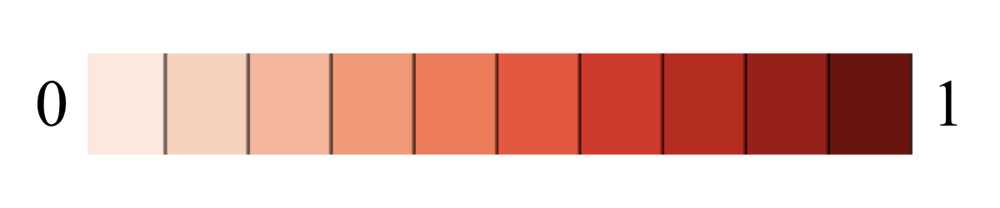

## Reliability and Validity

**Reliability** refers to the degree to which a test is consistent. 

**Validity** refers to the degree to which the test actually measures what you want to be measured. 

In class test theory, the observed score (X) of each person contains an error score (E) and a true score (T) which is the consistent score within individual. 

- **Reliability = Var_t / (Var_t + Var_e)**

Depending on the trait of interest, the true score (i.e. consistent score) of the observation may contain a certain unwanted signal. The true score variance is sum of variance of unwanted signal and trait of interest (i.e. Var_t = Var_ti + Var_tu). The validity is defined as the proportion of variation in the trait of interest to total variation of the observed score.

- **Reliability = (Var_ti + Var_tu) / (Var_ti + Var_tu + Var_e)**
- **Validity    =     Var_ti        / (Var_ti + Var_tu + Var_e)**
 
**Var_ti**: Variation of the trait of interest in the measurement

**Var_tu**: Variation of the unwanted score in the measurement

**Var_e**: Variation of the random noise

**Important Note 1**: **Reliability doesn't imply validity.** Reliability is the necessary but not sufficient condition to Validity. A reliable measure can be driven by systematic unwanted signal rather than valid signal of interest. For example, if a test has a 0.6 reliability, the validity of this test can range between 0 to 0.6 depends on how much of this test actually measures the specific trait of interest consistently.

**Important Note 2**: **reliability is the upper bar of the validity**. The valid score for a train of interest has to be consistent within individual. In other words, the proportion of the valid score is part of the consistent score. The best case is that no unwanted signal contaminate the consistent score. Thus, Validity ≤ Reliability. 

**Important Note 3**: **Validity is specific to the trait of interest.** A test can be highly valid for one trait but not valid for another. For example, [Raven's Progressive Matrices](https://en.wikipedia.org/wiki/Raven%27s_Progressive_Matrices) is valid measure general [human intelligence (IQ)](https://en.wikipedia.org/wiki/Intelligence_quotient), specifically, non-verbal [fluid intelligence](https://en.wikipedia.org/wiki/Fluid_and_crystallized_intelligence). However, it is not so valid to measure the [crystallized intelligence](https://en.wikipedia.org/wiki/Fluid_and_crystallized_intelligence). And it is not valid to measure [emotional intelligence (EI)](https://en.wikipedia.org/wiki/Emotional_intelligence). If we are interested in EI, then Raven's test is not valid. Of note, in both cases (using Raven's test to measure IQ or EI), the reliability of Raven's test are the same because the consistent signal (regardless of interest or unwanted) is the same.

### The theortical relationship between reliability and validity

reliability

validity

