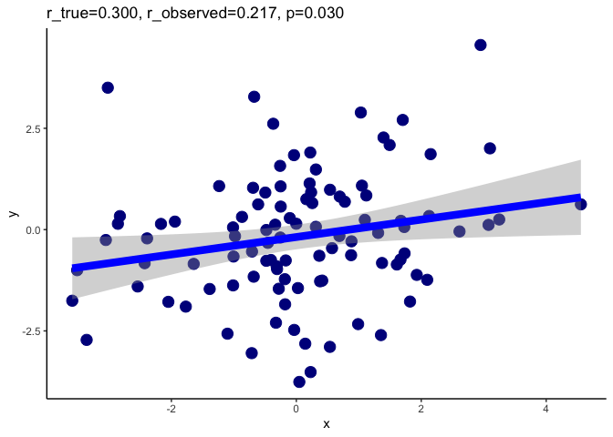
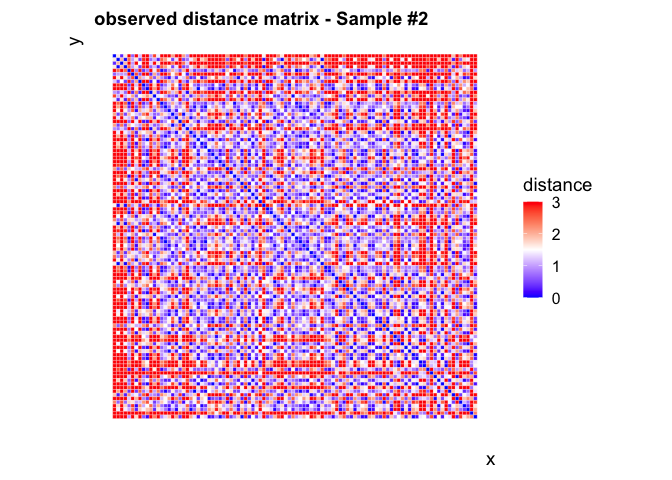

Simulation
================
Ting Xu (github: tingsterx/reliability_explorer)
2022-06-11

## Simulation: within individual variation contaminates the observed inter-individual variation

In the simulation, we assume that the subjects’ true scores follow a
normal distribution. Thus, we generated the “ground truth” scores Xtrue
for n subjects by randomly selecting n numbers from a Gaussian
distribution N(mu, sigma2_b). Here, sigma2_b represents the
between-individual variation, represents the population average. We
denoted Xtrue(i) as the “ground truth” score for the i-th subject. In
practice, a test always contains a certain variation (e.g. measurement
error). Thus, the observed score for each subject varies from its true
score within each subject. In the simulation, the measurement of the
true score for the i-th participant can be generated from the Gaussian
distribution N(Xtrue(i), sigma2_w), where sigma2_w is the
within-individual variation. We denote Xobserved(i, t) as the observed
score of the i-th subject at the time t.

We also simulated an association (i.e. r_true) with the above data
Xtrue. Specifically, we simulated a normally distributed vector, Ytrue,
with Pearson’s corr\[Xtrue, Ytrue\]=r_true. Similarly, the observed
score of Ytrue for each subject contains a certain within-individual
variation. In the simulation, we assume that the within-individual
variation of Yobserved is also sigma2_w. The observed correlation
estimation at the time t is corr\[Xobserved(t), Yobserved(t)\].

### load library

``` r
knitr::opts_chunk$set(echo = TRUE)
## load library
library(rstudioapi)
library(stats)
library(reshape)
library(RColorBrewer)
library(svglite)
library(faux)
```

    ## 
    ## ************
    ## Welcome to faux. For support and examples visit:
    ## https://debruine.github.io/faux/
    ## - Get and set global package options with: faux_options()
    ## ************

``` r
library(ggplot2)
```

### set path

``` r
setwd(dirname(getSourceEditorContext()$path))
source('func_plot.R')
out_dir <- 'simulation_individual_variation'
```

### simulate a true inter-individual variation

``` r
set.seed(0) 
n_subj <- 100
n_sess <- 1000
## ------------------------------------------
# simulate data with a certain between-individual variation (sigma2_b = 1)
mu <- 0
sigma2_b <- 1
# generate true scores for each individual 
true_x <- rnorm(n_subj, mean = mu, sd = sigma2_b)
# sort the subject based on the true score to make the figure pretty
sub_idx <- sort(true_x, index.return=TRUE)$ix

# plot the distance matrix of the true scores
d <- as.matrix(dist(true_x[sub_idx], diag=TRUE, upper=TRUE))
p <- distance_plot(d, 'true distance matrix', 0, 3); print(p)
```

    ## Warning in type.convert.default(X[[i]], ...): 'as.is' should be specified by the
    ## caller; using TRUE

    ## Warning in type.convert.default(X[[i]], ...): 'as.is' should be specified by the
    ## caller; using TRUE

<!-- -->

``` r
figout <- paste0(out_dir,"/Simulation_n=", toString(n_subj), "_true_individual_distance.png")
ggsave(file=figout, plot=p, width=10, height=10, bg = "transparent")
```

### simulate a true association

``` r
## simulate a true association 
r_perm <- 0.3
true_y <- rnorm_pre(true_x, mu = mu, sd = sigma2_b, r = r_perm, empirical = TRUE)
df <- data.frame(x=true_x, y=true_y)
r_true <- cor(df)[1,2]; r_p <- cor.test(true_x, true_y)$p.value
p <- reg_plot(df, size.point=4, size.line=3)
```

    ## Warning: Using `size` aesthetic for lines was deprecated in ggplot2 3.4.0.
    ## ℹ Please use `linewidth` instead.

``` r
p <- p + ggtitle(sprintf('r_true=%0.3f, p=%0.3f', r_true, r_p)); p
```

    ## `geom_smooth()` using formula = 'y ~ x'

<!-- -->

``` r
figout <- paste0(out_dir, "/Simulation_n=", toString(n_subj), "_true_association.png")
ggsave(file=figout, plot=p, width=10, height=8, bg = "transparent")
```

    ## `geom_smooth()` using formula = 'y ~ x'

### simulate observed individual score (with relative moderator within-individual variation, icc=0.6)

``` r
set.seed(1)
# icc <- sigma2_b/(sigma2_b + sigma2_w) 
icc <- 0.6
sigma2_w <- sigma2_b*(1-icc)/icc

# generate observed scores for each individual, the observed scores vary within individual with sigma2_w
# x
data_x <- matrix(0,n_subj, n_sess)
for (i in 1:n_subj){
  data_x[i,] <- rnorm(n_sess, mean = true_x[i], sd=sigma2_w)
}
# y
data_y <- matrix(0,n_subj, n_sess)
for (i in 1:n_subj){
  data_y[i,] <- rnorm(n_sess, mean = true_y[i], sd=sigma2_w)
}
# count how many simulations would generate the non-significant association 
r <- array(0, n_sess)
r_p <- array(0, n_sess)
for (i in 1:n_sess){
  rtest <-  cor.test(data_x[,i], data_y[,i])
  r[i] <- rtest$estimate
  r_p[i] <- rtest$p.value
}

p <- ggplot(data.frame(r=r), aes(x=r)) + 
  geom_histogram(aes(y=..density..), position="identity", alpha=0.5)+
  geom_density(alpha=0.6) + theme_classic() +
  ggtitle(sprintf("%0.2f percent of simulated observations are non-significant", (sum(r_p>0.05)/n_sess)*100))
p
```

    ## Warning: The dot-dot notation (`..density..`) was deprecated in ggplot2 3.4.0.
    ## ℹ Please use `after_stat(density)` instead.

    ## `stat_bin()` using `bins = 30`. Pick better value with `binwidth`.

<!-- -->

``` r
figout <- paste0(out_dir, "/Simulation_n=", toString(n_subj), "_good_icc_association_all_simulations.png")
ggsave(file=figout, plot=p, width=10, height=8, bg = "transparent")
```

    ## `stat_bin()` using `bins = 30`. Pick better value with `binwidth`.

``` r
p <- ggplot(data.frame(logP=-log10(r_p)), aes(x=logP)) + 
  geom_histogram(aes(y=..density..), position="identity", alpha=0.5, bins=100)+
  geom_density(alpha=0.6) + 
  geom_vline(xintercept=-log10(0.05), color = "red", size=1) +
  theme_classic() +
  ggtitle(sprintf("%0.2f percent of simulated observations are non-significant", (sum(r_p>0.05)/n_sess)*100))
p
```

<!-- -->

``` r
figout <- paste0(out_dir, "/Simulation_n=", toString(n_subj), "_good_icc_association_all_simulations_P.png")
ggsave(file=figout, plot=p, width=10, height=8, bg = "transparent")
```

### Plot the distance matrix for two observations

``` r
# -----------------------------
# plot
# -----------------------------
# plot the distance matrix of the one observation
session2plot <- which(r_p<0.05)[1]
d <- as.matrix(dist(data_x[sub_idx,session2plot], diag=TRUE, upper=TRUE))
p <- distance_plot(d, 'observed distance matrix - Sample #1', 0, 3); p
```

    ## Warning in type.convert.default(X[[i]], ...): 'as.is' should be specified by the
    ## caller; using TRUE

    ## Warning in type.convert.default(X[[i]], ...): 'as.is' should be specified by the
    ## caller; using TRUE

<!-- -->

``` r
figout <- paste0(out_dir, "/Simulation_n=", toString(n_subj), "_good_icc_individual_distance_sample1.png")
ggsave(file=figout, plot=p, width=10, height=10, bg = "transparent")

df <- data.frame(y=data_y[,session2plot], x=data_x[,session2plot])
rtest <- cor.test(df$x, df$y)
p <- reg_plot(df, size.point=4, size.line=3)
p <- p + ggtitle(sprintf('r_true=%0.3f, r_observed=%0.3f, p=%0.3f', r_true, rtest$estimate, rtest$p.value)); p
```

    ## `geom_smooth()` using formula = 'y ~ x'

<!-- -->

``` r
figout <- paste0(out_dir, "/Simulation_n=", toString(n_subj), "_good_icc_association_sample1.png")
ggsave(file=figout, plot=p, width=10, height=8, bg = "transparent")
```

    ## `geom_smooth()` using formula = 'y ~ x'

``` r
# plot the distance matrix of the another observation
session2plot <- which(r_p>0.05)[1]
d <- as.matrix(dist(data_x[sub_idx,session2plot], diag=TRUE, upper=TRUE))
p <- distance_plot(d, 'observed distance matrix - Sample #2', 0, 3); p
```

    ## Warning in type.convert.default(X[[i]], ...): 'as.is' should be specified by the
    ## caller; using TRUE

    ## Warning in type.convert.default(X[[i]], ...): 'as.is' should be specified by the
    ## caller; using TRUE

<!-- -->

``` r
figout <- paste0(out_dir, "/Simulation_n=", toString(n_subj), "_good_icc_individual_distance_sample2.png")
ggsave(file=figout, plot=p, width=10, height=10, bg = "transparent")

df <- data.frame(y=data_y[,session2plot], x=data_x[,session2plot])
rtest <- cor.test(df$x, df$y)
p <- reg_plot(df, size.point=4, size.line=3)
p <- p + ggtitle(sprintf('r_true=%0.3f, r_observed=%0.3f, p=%0.3f', r_true, rtest$estimate, rtest$p.value)); p
```

    ## `geom_smooth()` using formula = 'y ~ x'

<!-- -->

``` r
figout <- paste0(out_dir, "/Simulation_n=", toString(n_subj), "_good_icc_association_sample2.png")
ggsave(file=figout, plot=p, width=10, height=8, bg = "transparent")
```

    ## `geom_smooth()` using formula = 'y ~ x'

### simulate observed individual score (with relative small within-individual variation, icc=0.4)

``` r
set.seed(2)
# icc <- sigma2_b/(sigma2_b + sigma2_w) 
icc <- 0.4
sigma2_w <- sigma2_b*(1-icc)/icc
# generate observed scores for each individual, the observed scores vary within individual with sigma2_w
# x
data_x <- matrix(0,n_subj, n_sess)
for (i in 1:n_subj){
  data_x[i,] <- rnorm(n_sess, mean = true_x[i], sd=sigma2_w)
}
# y
data_y <- matrix(0,n_subj, n_sess)
for (i in 1:n_subj){
  data_y[i,] <- rnorm(n_sess, mean = true_y[i], sd=sigma2_w)
}
# count how many simulations would generate the non-significant association 
r <- array(0, n_sess)
r_p <- array(0, n_sess)
for (i in 1:n_sess){
  rtest <-  cor.test(data_x[,i], data_y[,i])
  r[i] <- rtest$estimate
  r_p[i] <- rtest$p.value
}

p <- ggplot(data.frame(r=r), aes(x=r)) + 
  geom_histogram(aes(y=..density..), position="identity", alpha=0.5)+
  geom_density(alpha=0.6) + 
  ggtitle(sprintf("%0.2f percent of simulations have non-significant association observed", (sum(r_p>0.05)/n_sess)*100))
p
```

    ## `stat_bin()` using `bins = 30`. Pick better value with `binwidth`.

<!-- -->

``` r
figout <- paste0(out_dir, "/Simulation_n=", toString(n_subj), "_fair_icc_association_all_simulations.png")
ggsave(file=figout, plot=p, width=10, height=8, bg = "transparent")
```

    ## `stat_bin()` using `bins = 30`. Pick better value with `binwidth`.

``` r
p <- ggplot(data.frame(logP=-log10(r_p)), aes(x=logP)) + 
  geom_histogram(aes(y=..density..), position="identity", alpha=0.5, bins=100)+
  geom_density(alpha=0.6) + 
  geom_vline(xintercept=-log10(0.05), color = "red", size=1) +
  theme_classic() +
  ggtitle(sprintf("%0.2f percent of simulated observations are non-significant", (sum(r_p>0.05)/n_sess)*100))
p
```

<!-- -->

``` r
figout <- paste0(out_dir, "/Simulation_n=", toString(n_subj), "_fair_icc_association_all_simulations_P.png")
ggsave(file=figout, plot=p, width=10, height=8, bg = "transparent")
```

### Plot the distance matrix for two observations

``` r
# -----------------------------
# plot
# -----------------------------
# plot the distance matrix of the 1st observed sample (Sample #1)
session2plot <- which(r_p<0.05)[1]
d <- as.matrix(dist(data_x[sub_idx,session2plot], diag=TRUE, upper=TRUE))
p <- distance_plot(d, 'observed distance matrix - Sample #1', 0, 3); p
```

    ## Warning in type.convert.default(X[[i]], ...): 'as.is' should be specified by the
    ## caller; using TRUE

    ## Warning in type.convert.default(X[[i]], ...): 'as.is' should be specified by the
    ## caller; using TRUE

<!-- -->

``` r
figout <- paste0(out_dir, "/Simulation_n=", toString(n_subj), "_fair_icc_individual_distance_sample1.png")
ggsave(file=figout, plot=p, width=10, height=10, bg = "transparent")

df <- data.frame(y=data_y[,session2plot], x=data_x[,session2plot])
rtest <- cor.test(df$x, df$y)
p <- reg_plot(df, size.point=4, size.line=3)
p <- p + ggtitle(sprintf('r_true=%0.3f, r_observed=%0.3f, p=%0.3f', r_true, rtest$estimate, rtest$p.value)); p
```

    ## `geom_smooth()` using formula = 'y ~ x'

<!-- -->

``` r
figout <- paste0(out_dir, "/Simulation_n=", toString(n_subj), "_fair_icc_association_sample1.png")
ggsave(file=figout, plot=p, width=10, height=8, bg = "transparent")
```

    ## `geom_smooth()` using formula = 'y ~ x'

``` r
# plot the distance matrix of the 2nd observed sample (Sample #2)
session2plot <- which(r_p>0.05)[1]
d <- as.matrix(dist(data_x[sub_idx,session2plot], diag=TRUE, upper=TRUE))
p <- distance_plot(d, 'observed distance matrix - Sample #2', 0, 3); p
```

    ## Warning in type.convert.default(X[[i]], ...): 'as.is' should be specified by the
    ## caller; using TRUE

    ## Warning in type.convert.default(X[[i]], ...): 'as.is' should be specified by the
    ## caller; using TRUE

<!-- -->

``` r
figout <- paste0(out_dir, "/Simulation_n=", toString(n_subj), "_fair_icc_individual_distance_sample2.png")
ggsave(file=figout, plot=p, width=10, height=10, bg = "transparent")

df <- data.frame(y=data_y[,session2plot], x=data_x[,session2plot])
rtest <- cor.test(df$x, df$y)
p <- reg_plot(df, size.point=4, size.line=3)
p <- p + ggtitle(sprintf('r_true=%0.3f, r_observed=%0.3f, p=%0.3f', r_true, rtest$estimate, rtest$p.value)); p
```

    ## `geom_smooth()` using formula = 'y ~ x'

<!-- -->

``` r
figout <- paste0(out_dir, "/Simulation_n=", toString(n_subj), "_fair_icc_association_sample2.png")
ggsave(file=figout, plot=p, width=10, height=8, bg = "transparent")
```

    ## `geom_smooth()` using formula = 'y ~ x'

## 
