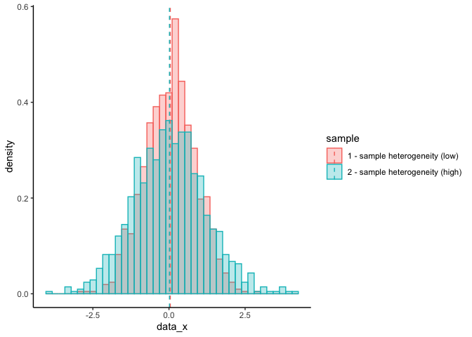
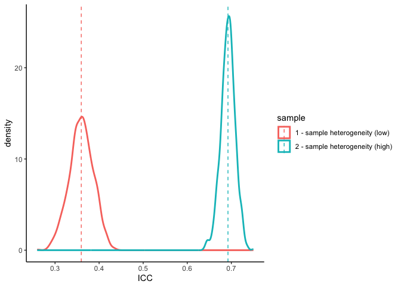
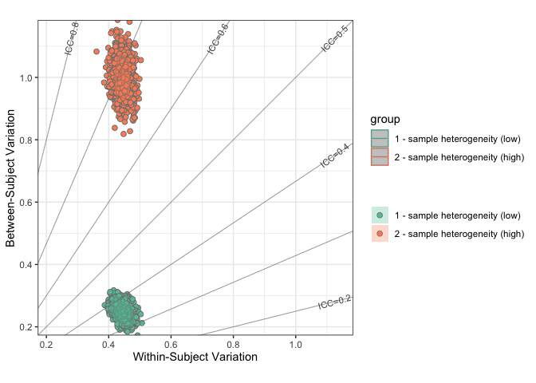

R Notebook
================

## simulation - heterogeneous participant sample

``` r
# Let the between-individual variation of the population (sigma2_b=1)
sigma2_b <- 1
# Let the ICC=0.6 of a measurement
icc <- 0.6
# Note: icc <- sigma2_b/(sigma2_b + sigma2_w) 
sigma2_w <- sigma2_b*(1-icc)/icc
# population mean
mu <- 0
# 
n_subj <- 1000
n_sess <- 2
n_simulation <- 1000
# ------------------------------------------------------------------------------
# sampling the population with more heterogeneous participant
mu_sample <- mu
sigma2_b_sample <- sigma2_b
sigma2_w_sample <- sigma2_w
# simulation
df1.icc <- data.frame()
df1.data <- data.frame()
set.seed(123) 
for (p in 1:n_simulation){
  # generate true score for each individual
  true_x <- rnorm(n_subj, mean=mu_sample, sd = sigma2_b_sample)
  # add within-individual variation to generate observed scores
  data_x <- matrix(0, n_subj, n_sess)
  session <- matrix(0, n_subj, n_sess)
  subID <- matrix(0, n_subj, n_sess)
  for (i in 1:n_subj){
    data_x[i,] <- rnorm(n_sess, mean = true_x[i], sd=sigma2_w_sample)
    session[i,] <- 1:n_sess
    subID[i,] <- i
  }
  data_x <- array(data_x, c(n_subj*n_sess, 1))
  # calculate the icc 
  subID <- array(subID, c(n_subj*n_sess, 1))
  session <- array(session, c(n_subj*n_sess, 1))
  df.p <- ReX::lme_ICC_1wayR(data_x,subID,session)
  df1.icc <- rbind(df1.icc, df.p)
  
  df.data <- data.frame(data_x=data_x, session=session, permutation=p)
  df1.data <- rbind(df1.data, df.data)
}
```


``` r
# ------------------------------------------------------------------------------
# sampling the population with less heterogeneous participant
mu_sample <- mu
sigma2_b_sample <- 0.5
sigma2_w_sample <- sigma2_w
# simulation
df2.icc <- data.frame()
df2.data <- data.frame()
set.seed(23) 
for (p in 1:n_simulation){
  # generate true score for each individual
  true_x <- rnorm(n_subj, mean=mu_sample, sd = sigma2_b_sample)
  # add within-individual variation to generate observed scores
  data_x <- matrix(0, n_subj, n_sess)
  session <- matrix(0, n_subj, n_sess)
  subID <- matrix(0, n_subj, n_sess)
  for (i in 1:n_subj){
    data_x[i,] <- rnorm(n_sess, mean = true_x[i], sd=sigma2_w_sample)
    session[i,] <- 1:n_sess
    subID[i,] <- i
  }
  data_x <- array(data_x, c(n_subj*n_sess, 1))
  if (p==1){
    data_example2 <- data.frame(true_x=true_x, data_x=data_x)
  }
  # calculate the icc 
  subID <- array(subID, c(n_subj*n_sess, 1))
  session <- array(session, c(n_subj*n_sess, 1))
  df.p <- ReX::lme_ICC_1wayR(data_x,subID,session)
  df2.icc <- rbind(df2.icc, df.p)
  
  df.data <- data.frame(data_x=data_x, session=session, permutation=p)
  df2.data <- rbind(df2.data, df.data)
}
```


``` r
df1 <- df1.data %>% filter(permutation==1, session==1)
df2 <- df2.data %>% filter(permutation==1, session==1)
df1$sample <- '2 - sample heterogeneity (high)'
df2$sample <- '1 - sample heterogeneity (low)'
df<- rbind(df2, df1)
sample.mean <- df %>% group_by(sample) %>% summarise(sample.mean=mean(data_x))
ggplot(df, aes(x=data_x, color=sample, fill=sample)) +
  geom_histogram(aes(y=..density..), position="identity", alpha=0.3, bins=40)+
  #geom_density(alpha=0, linewidth=1)+
  geom_vline(data=sample.mean, aes(xintercept=sample.mean, color=sample),
           linetype="dashed")+
  theme_classic()
```

    ## Warning: The dot-dot notation (`..density..`) was deprecated in ggplot2 3.4.0.
    ## ℹ Please use `after_stat(density)` instead.

<!-- -->

``` r
df1.data$sample <- '2 - sample heterogeneity (high)'
df2.data$sample <- '1 - sample heterogeneity (low)'
df <- rbind(df1.data, df2.data)
sample.mean <- df %>% group_by(sample) %>% summarise(sample.mean=mean(data_x))
ggplot(df, aes(x=data_x, color=sample, fill=sample)) +
  #geom_histogram(aes(y=..density..), position="identity", alpha=0.3, bins=40)+
  geom_density(alpha=0, linewidth=1)+
  geom_vline(data=sample.mean, aes(xintercept=sample.mean, color=sample),
           linetype="dashed")+
  theme_classic()
```

<!-- -->

``` r
# ICC
df1.icc$sample <- '2 - sample heterogeneity (high)'
df2.icc$sample <- '1 - sample heterogeneity (low)'
df <- rbind(df1.icc, df2.icc)
df %>% group_by(sample) %>% summarise(mean(ICC), sd(ICC))
```

    ## # A tibble: 2 × 3
    ##   sample                         `mean(ICC)` `sd(ICC)`
    ##   <chr>                                <dbl>     <dbl>
    ## 1 1 - sample heterogeneity (low)        0.360    0.0272
    ## 2 2 - sample heterogeneity (high)       0.692    0.0162

``` r
sample.mean <- df %>% group_by(sample) %>% summarise(sample.mean=mean(ICC))
ggplot(df, aes(x=ICC, color=sample, fill=sample)) +
  #geom_histogram(aes(y=..density..), position="identity", alpha=0.3, bins=40)+
  geom_density(alpha=0, linewidth=1)+
  geom_vline(data=sample.mean, aes(xintercept=sample.mean, color=sample),
           linetype="dashed")+
  theme_classic()
```

<!-- -->

``` r
ReX::rex_plot.var.field.n(df, group.name = "sample", size.point=2)
```

<!-- -->

``` r
df.diff <- ReX::icc_gradient_flow(df2.icc$sigma2_w, df2.icc$sigma2_b, df1.icc$sigma2_w, df1.icc$sigma2_b)
df.diff$delta.icc <- df2.icc$ICC - df1.icc$ICC
df.diff$contrast <- sprintf('sample heterogeneity: high -> low')
ReX::rex_plot.icc.gradient.norm(df.diff, size.point=2)
```

<!-- -->

------------------------------------------------------------------------
