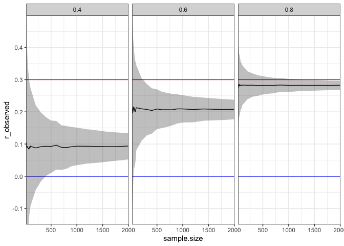

Simulation
================
Ting Xu
2022-07-12

## Simulation: Impact of the within-individual variation, sample size, and reliability on testing association between two variables of interest

## simulation (fair reliability) setting

sample size: 10, 20, …, 100, 200, …, 1000, 1200, … 2000

reliability: 0.4, 0.6, 0.8

simulation: 10000 times

``` r
set.seed(0) 

n_subj_list <- c(seq(10,90,10), seq(100,1000,100), seq(1200,2000,200))
n_samples <- length(n_subj_list)
n_sess <- 10000 # num of simulation at each sample size
mu <- 0
r_perm <- 0.3
sigma2_b <- 1
icc_list <- c(0.8, 0.6, 0.4) # icc <- sigma2_b/(sigma2_b + sigma2_w) 
sigma2_w_list <- sigma2_b*(1-icc_list)/icc_list
n_icc <- length(icc_list)
```

``` r
## ------------------------------------------
r_true <- array(0, dim=c(n_samples, n_icc))
r_observed <- array(0, dim=c(n_sess, n_samples, n_icc))
p_observed <- array(0, dim=c(n_sess, n_samples, n_icc))
for (m in 1:n_icc){
  icc <- icc_list[m]
  sigma2_w <- sigma2_w_list[m]
  for (k in 1:n_samples){
    n_subj <- n_subj_list[k]
    # simulate true X with a certain between-individual variation (sigma2_b)
    true_x <- rnorm(n_subj, mean = mu, sd = sigma2_b)
    # simulate true Y associated with X
    true_y <- rnorm_pre(true_x, mu = mu, sd = sigma2_b, r = r_perm, empirical = TRUE)
    # calculate the true correlation of the simulated data
    r_true[k,m] <- cor.test(true_x, true_y)$estimate
    # simulate X_observed and Y_observed
    data_x <- matrix(0, n_subj, n_sess)
    data_y <- matrix(0, n_subj, n_sess)
    for (i in 1:n_subj){
      data_x[i,] <- rnorm(n_sess, mean = true_x[i], sd=sigma2_w)
      data_y[i,] <- rnorm(n_sess, mean = true_y[i], sd=sigma2_w)
    }
    # observed corr for each session
    for (i in 1:n_sess){
      rtest <-  cor.test(data_x[,i], data_y[,i])
      r_observed[i,k,m] <- rtest$estimate
      p_observed[i,k,m] <- rtest$p.value
    }
  }
}
save(r_observed, p_observed, r_true, file=paste0(out_dir, '/data_simulation.rds'))
```

## load in the simulated data and calcualte the

``` r
load(paste0(out_dir, '/data_simulation.rds'))
r_avg <- apply(r_observed, c(2,3), mean)
conf_lw <- apply(r_observed, c(2,3), quantile, probs=0.025)
conf_up <- apply(r_observed, c(2,3), quantile, probs=0.975)
df <- data.frame()
for (m in 1:n_icc){
  df1 <- data.frame(sample.size=n_subj_list, r_observed=r_avg[,m], conf_lw=conf_lw[,m], conf_up=conf_up[,m])
  df1$icc <- icc_list[m]
  df1$sigma2_b <- sigma2_b
  df1$sigma2_w <- sigma2_w_list[m]
  df1$r_true <- r_true[,m]
  df <- rbind(df, df1)
}
```

## 

``` r
# 
df_plot <- subset(df, sample.size>10)
df_plot$conf_up[df_plot$conf_up> 0.5] = 0.5
df_plot$conf_lw[df_plot$conf_lw< -0.15] = -0.15
p <- ggplot(df_plot, aes(sample.size, r_observed)) + 
  facet_grid(cols = vars(icc)) +
  geom_hline(yintercept = 0, color="blue") +
  geom_line(aes(x=sample.size, y=r_true), color='red') +
  geom_line(aes(x=sample.size, y=r_observed)) +
  geom_ribbon(aes(ymin=conf_lw, ymax=conf_up), alpha=0.3) +
  xlim(0, 2000) + ylim(-0.15, 0.5) +
  scale_x_continuous(expand=c(0,0)) +
  scale_y_continuous(expand=c(0,0)) +
  theme_bw()
```

    ## Scale for x is already present.
    ## Adding another scale for x, which will replace the existing scale.
    ## Scale for y is already present.
    ## Adding another scale for y, which will replace the existing scale.

``` r
p
```

<!-- -->

``` r
figout <- sprintf("%s/simulation_sample_size_and_estimated_corr__true_r=%0.2f.png", out_dir, r_perm)
ggsave(file=figout, plot=p, width=10, height=6, bg = "transparent")
```
