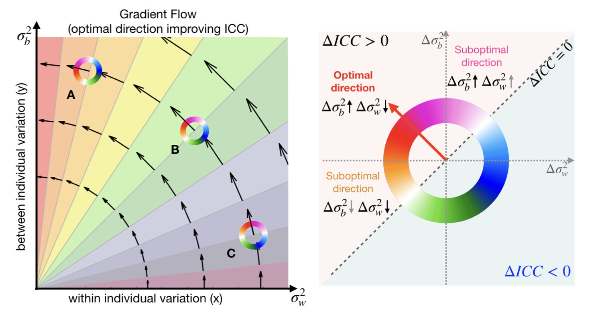
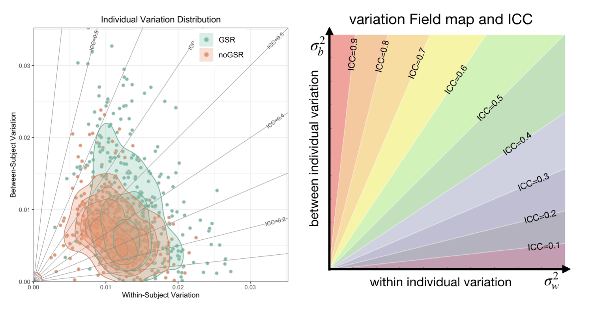

## Compare ICC and Individual Variation

----

#### Theoretical gradient flow - the most efficient direction for improving ICC

- Contributions of the within- and between-individual variation for improving the reliability are not always the same. 
- For example: point **A**: the reduction in x (within-individual variation) improves ICC more than a similar increment in y (between-individual variation); point **C**: the reduction in y (between-individual variation) improves ICC more than a similar increment in x (within-individual variation)
- **Gradient flow** characterizes the most efficient direction for improving ICC

----

#### Example:

Compare ICC and individual variation of cortical functional connectivity (seed: PCC) estimated from two methods, with and without global signal regression (GSR).

Note: Demo data are provided in **"Compare Results"** module on the [shiny app](https://tingsterx.shinyapps.io/ReliabilityExplorer) (Data1: without GSR, Data2: with GSR).

##### **Individual Variation Distribution**

----

##### **Pairwise Comparison** 

Compare ICC between two methods (GSR vs. noGSR) for each cortical functional connectivity (seed: PCC).

**Note**: The above **delta ICC map** shows the change of ICC at each brain region using GSR vs. noGSR methods. Compare to the noGSR result, GSR method shows higher ICC in the medial and lateral associate cortex but lower ICC in the somatomotor region. **Question:** What is the contribution of within- and between-individual variation for this ICC changes?

&nbsp;

&nbsp;&nbsp;&nbsp;&nbsp;&nbsp;&nbsp; **Change of variation (GSR vs. noGSR)**

**Note**: It is still not clear whether the change of variation (the 2nd and 3nd quadrant) increase or decrease ICC. 

&nbsp;

&nbsp;&nbsp;&nbsp;&nbsp;&nbsp;&nbsp; **Gradient map: Normalized change of variation (GSR vs. noGSR)**

&nbsp;

&nbsp;&nbsp;&nbsp;&nbsp;&nbsp;&nbsp; **ICC gradient map on the cortex** and **gradient histogram**

Contribution of within- and between-individual variation for change of ICC (GSR vs. noGSR)

