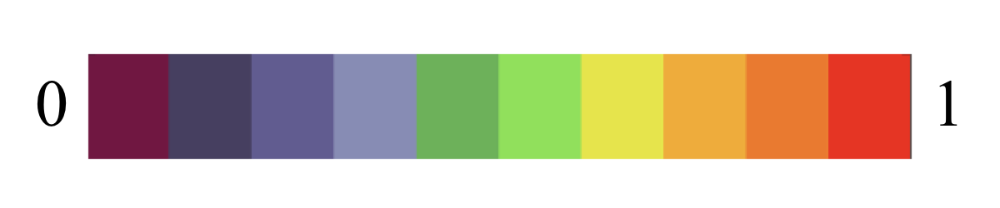

## Variation Field Map and Intraclass correlation (ICC)

----

#### Intraclass correlation (ICC) model 
- ICC definition, ICC types (ICC(1,1), ICC(2,1), ICC(3,1)) in the Linear Mixed Model. See [**ICC Model Tutorial**](https://github.com/TingsterX/Reliability_Explorer/blob/main/tutorial_ICC_in_R.ipynb)

----

#### Theoretical Variation Field Map (3D)

- x-axis: within-individual variation  
- y-axis: between-individual variation 
- z-axis: ICC (intraclass correlation), ICC=y/(x+y)

The interactive plot is on the shiny app - [Reliability Explorer](https://tingsterx.shinyapps.io/ReliabilityExplorer), or [docker version](https://github.com/TingsterX/Reliability_Explorer)

#### Theoretical Individual Variation Field (2D)
- x-axis: within-individual variation
- y-axis: between-individual variation 

ICC colormap: 

----

#### Example

Measuring the intraclass correlation and individual variation of functional connectivity between 360 brain regions to the seed region - posterior cingulate cortex (PCC).

Note: Demo data are provided in **"Calculate"** module on the [shiny app](https://tingsterx.shinyapps.io/ReliabilityExplorer).

**Individual variation and ICC field map**: Each dot represents the variation of connectivity from one brain region to PCC. Regions with higher ICC have relatively higher between-individual variation and lower within-individual variation.

&nbsp;

**ICC map on the cortex**

----

