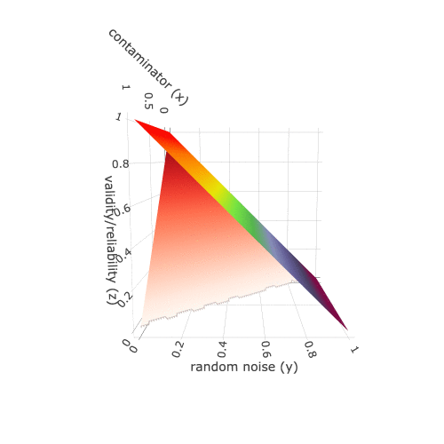

### Reliability and Validity

**Reliability** refers to the degree to which a test is consistent.

**Validity** refers to the degree to which the test actually measures
what you want to be measured.

**Note 1**: **Reliability doesn’t imply validity.** Reliability is the
necessary but not sufficient condition to Validity. A reliable measure
can be driven by systematic artefact rather than valid signal. However,
Validity is a sufficient condition for reliability. A highly valid
measure must be reliable. See equations below

-   Validity = Var\_t / (Var\_t + Var\_c + Var\_r)
-   Reliability = (Var\_t + Var\_c) / (Var\_t + Var\_c + Var\_r)

Var\_t: Variation of the trait of interest in the measurement

Var\_c: Variation of the contaminants in the measurement
(e.g. systematic noise, unwanted signal)

Var\_r: Variation of the random noise

Specifically, if a test has a 0.6 reliability, the validity of this test
can range between 0 to 0.6 depends on how much of this test actually
measures the specific trait of interest. In other words, **reliability
is the upper bar of the validity**. If a test has a 0.6 validity,
meaning that the true score is 60% consistently measured in the
observations, the reliability of this test must be &gt;= 0.6. If there
is a consistent unwanted signal contaminate the observed score. The
consistent signal (both ture and unwanted scores) would make the
reliability over 0.6.

**Note 2**: **Validity is specific to the trait of interest.** A test
can be highly valid for one trait but not valid for another. For
example, [Raven’s Progressive
Matrices](https://en.wikipedia.org/wiki/Raven%27s_Progressive_Matrices)
is valid measure general [human intelligence
(IQ)](https://en.wikipedia.org/wiki/Intelligence_quotient),
specifically, non-verbal [fluid
intelligence](https://en.wikipedia.org/wiki/Fluid_and_crystallized_intelligence).
However, it is not so valid to measure the [crystallized
intelligence](https://en.wikipedia.org/wiki/Fluid_and_crystallized_intelligence).
And it is not valid to measure [emotional intelligence
(EI)](https://en.wikipedia.org/wiki/Emotional_intelligence). If we are
interested in EI, then Raven’s test is not valid. Of note, in both cases
(using Raven’s test to measure IQ or EI), the reliability of Raven’s
test are the same because the consistent signal (regardless of interest
or unwanted) is the same.

#### Theoretical relationship between **Reliability** and **Validity** (3D)

-   x-axis: contaminator (i.e. consistent unwanted signal)
-   y-axis: errors (i.e. random noise that makes the observation vary
    randomly)
-   z-axis: reliability/validity

**Note**: 
When contaminator=0, reliability=validity. Otherwise, reliability > validity

